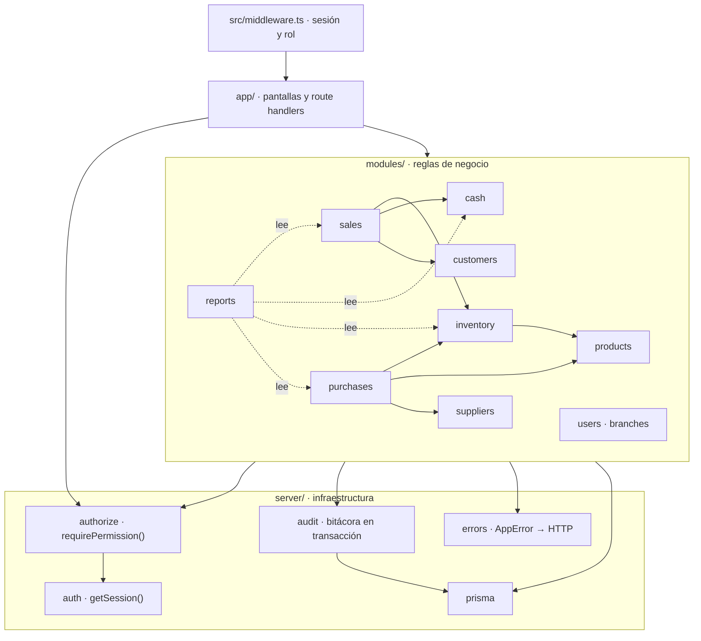
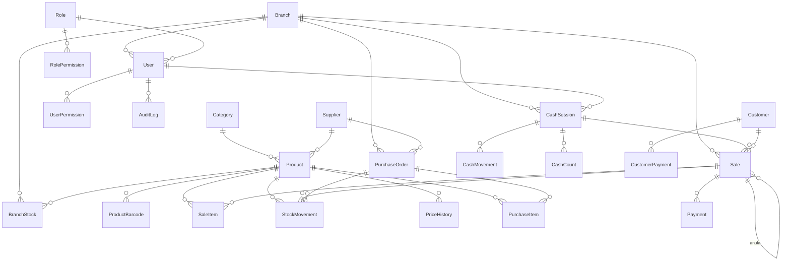

# Propuesta de arquitectura y funcionalidades

> Cubre las etapas 5 y 6 del brief: qué funcionalidades faltan para que esto sea un sistema de almacén, y cómo organizar el código para sostenerlas.
> Parte del inventario de [CURRENT_SYSTEM_AUDIT.md](CURRENT_SYSTEM_AUDIT.md).

> **Estado a la Fase 1.** La Parte II (organización del código) está
> **implementada**. La Parte I (funcionalidades) sigue siendo un plan: la
> Fase 1 fue de consolidación, sin funcionalidad nueva.
>
> Lo que quedó del lado de la organización:
>
> ```
> src/modules/<dominio>/
>   schemas.ts   validación de entrada (Zod)
>   service.ts   reglas de negocio
>   dto.ts       forma de los datos en la API y su lectura en el cliente
> ```
>
> Dominios con servicio: `sales`, `stock`, `cash`, `products`, `users`. Los
> catálogos auxiliares —sucursales, categorías, proveedores, roles— comparten
> `modules/catalog/schemas.ts` y no tienen servicio: son CRUD sin reglas
> propias, y tres módulos de un archivo cada uno serían ceremonia sin
> utilidad.
>
> Medido sobre los 19 archivos de ruta, antes y después:
>
> |                                       | Antes | Después |
> | ------------------------------------- | ----: | ------: |
> | Líneas de código en rutas             |  1309 |     681 |
> | Líneas con consulta Prisma            |    55 |      18 |
> | Líneas con transacción o SQL crudo    |    13 |       4 |
> | Esquemas definidos dentro de una ruta |    16 |       0 |
>
> **No se crearon repositorios.** Los servicios usan Prisma directamente. Una
> capa de repositorio sobre un ORM que ya abstrae el SQL sería una indirección
> sin nada del otro lado; se agregará si algún día hace falta cambiar de
> motor o de ORM, no antes.

---

# Parte I · Funcionalidades

Solo se listan las que **no existen hoy**. Lo que ya funciona está en el §9 del documento de auditoría.

## 1. Productos

| Falta                               | Prioridad | Por qué en un almacén                                                                                                                                      |
| ----------------------------------- | --------- | ---------------------------------------------------------------------------------------------------------------------------------------------------------- |
| **Costo y margen**                  | MVP       | Sin costo no hay rentabilidad, ni valorización de stock, ni saber si un aumento del proveedor se comió la ganancia. El campo `value` existe y nadie lo usa |
| **Múltiples códigos de barras**     | MVP       | La misma gaseosa cambia de código entre lotes. Hoy `barcode` es uno solo                                                                                   |
| **Unidad de venta y de compra**     | MVP       | Se compra la caja de 6 y se vende la botella. Sin esto la recepción no puede convertir                                                                     |
| **Stock mínimo e ideal**            | MVP       | Hoy el umbral es `< 10` fijo en tres archivos. Un almacén no repone la yerba y los fósforos con el mismo criterio                                          |
| **Producto activo / discontinuado** | MVP       | Hoy sacar un producto exige borrarlo, lo que rompe el historial de ventas                                                                                  |
| **Marca**                           | MVP       | Es el segundo criterio de búsqueda después del nombre                                                                                                      |
| **Proveedor principal**             | MVP       | El campo existe en el esquema y ninguna pantalla lo usa                                                                                                    |
| Precio mayorista                    | 2.ª etapa |                                                                                                                                                            |
| Impuestos por producto              | 2.ª etapa | Necesario si en algún momento se factura                                                                                                                   |
| Ubicación física                    | 2.ª etapa | Góndola y estante: acelera el conteo y la reposición                                                                                                       |
| Imagen                              | 2.ª etapa | Útil para lo que no tiene código: verdulería, suelto                                                                                                       |
| Historial de precios y costos       | 2.ª etapa | Responde "¿cuánto costaba esto en marzo?"                                                                                                                  |
| Peso o volumen                      | 2.ª etapa |                                                                                                                                                            |

**Unidades a soportar:** unidad, kilogramo, gramo, litro, mililitro, paquete, caja, botella, lata, docena.

**Venta por peso** merece una decisión aparte. Un almacén con fiambrería o verdulería la necesita: el producto se define en kg y la venta lleva una cantidad decimal. Requiere que `SaleItem.quantity` deje de ser `Int`.

## 2. Inventario

Hoy no hay módulo de stock: hay un número mutable en `BranchStock.quantity` y una API sin pantalla.

| Falta                                                                                                          | Prioridad |
| -------------------------------------------------------------------------------------------------------------- | --------- |
| **Libro de movimientos de stock** — cada cambio es un asiento inmutable con tipo, motivo, usuario y referencia | **MVP**   |
| **Ajustes con motivo obligatorio** (rotura, vencido, consumo interno, error de carga, robo)                    | **MVP**   |
| **Recepción de mercadería** que impacte stock y costo                                                          | **MVP**   |
| **Prevención de stock negativo**                                                                               | **MVP**   |
| **Alertas por debajo del mínimo**                                                                              | **MVP**   |
| Conteos de inventario con diferencias                                                                          | 2.ª etapa |
| Transferencias entre sucursales                                                                                | 2.ª etapa |
| Lotes y vencimientos                                                                                           | 2.ª etapa |
| Stock reservado vs. disponible                                                                                 | 2.ª etapa |
| Trazabilidad completa por producto                                                                             | 2.ª etapa |

> **El libro de movimientos es el cambio conceptual más importante de toda la propuesta.** Hoy `quantity` es un número que se sobrescribe; nadie puede reconstruir por qué llegó a su valor. Con un libro de asientos, el stock actual es la suma de sus movimientos, cada uno con su motivo, y el descuadre siempre tiene explicación. Es el mismo cambio que se propone para la caja.

## 3. Compras y proveedores

> **Implementado en la Fase 3C.** Ver [PURCHASE_FLOW.md](PURCHASE_FLOW.md),
> [PURCHASE_RECEIVING.md](PURCHASE_RECEIVING.md) y
> [SUPPLIER_MODEL.md](SUPPLIER_MODEL.md).

| Falta                                                       | Prioridad | Estado                                             |
| ----------------------------------------------------------- | --------- | -------------------------------------------------- |
| **Alta y edición de proveedores**                           | **MVP**   | **Hecho.** Sólo el nombre es obligatorio           |
| **Orden de compra** (productos, cantidades, costo esperado) | **MVP**   | **Hecho.** Cinco estados, numeración por secuencia |
| **Recepción total o parcial**, con actualización de costo   | **MVP**   | **Hecho.** Política _last received cost_           |
| **Aviso de variación de costo y su efecto sobre el margen** | **MVP**   | **Hecho.** La diferencia queda visible y auditada  |
| Cuenta corriente del proveedor: deuda, pagos, comprobantes  | 2.ª etapa | Pendiente                                          |
| Historial de compras por proveedor                          | 2.ª etapa | **Hecho** en la ficha del proveedor                |
| Comparación de precios entre proveedores                    | 2.ª etapa | Parcial: `ProductSupplier.lastCost` por proveedor  |
| Sugerencia de reposición según mínimo y venta histórica     | 2.ª etapa | Parcial: borrador desde bajo mínimo, sin histórico |
| Devolución a proveedor                                      | —         | Pendiente. Punto de extensión documentado          |

### Lo que la Fase 3C decidió, y por qué

**Orden y recepción son entidades distintas.** Una orden dice lo que se pidió;
una recepción, lo que llegó. Casi nunca coinciden, y con las recepciones dentro
de la orden el sistema podría decir _cuánto_ llegó pero no _cuándo llegó cada
parte, a qué precio y quién la recibió_.

**`unitCost` es por unidad de compra.** Una caja de 8 a $8.800 guarda `8800`, y
lo que llega a `Product.cost` es `8800 ÷ 8 = 1100`. La conversión vive en un
solo archivo y tiene dos implementaciones —enteros para el navegador, `Decimal`
para el servidor— con una prueba que las compara sobre la misma tabla de casos.

**El costo lo fija la última recepción**, no un promedio ponderado. Para un
almacén el precio de venta se decide mirando a cuánto hay que _reponer_, no a
cuánto costó lo que está en la góndola.

## 4. Ventas

| Falta                                                      | Prioridad       |
| ---------------------------------------------------------- | --------------- |
| **Precio tomado del servidor** (hoy lo manda el navegador) | **MVP — es P0** |
| **Venta atómica**                                          | **MVP — es P0** |
| **Anulación con motivo, permiso y reversión de stock**     | **MVP**         |
| **Devolución parcial**                                     | **MVP**         |
| **Descuentos con permiso y tope**                          | **MVP**         |
| **Pago combinado y vuelto**                                | **MVP**         |
| **Ventas en espera**                                       | **MVP**         |
| **Número de comprobante y estado de la venta**             | **MVP**         |
| Comprobante impreso o PDF, y reimpresión                   | 2.ª etapa       |
| Venta fiada a cuenta corriente                             | 2.ª etapa       |
| Promociones y combos                                       | 2.ª etapa       |
| Precio mayorista por cantidad                              | 2.ª etapa       |
| Nota de crédito interna                                    | 2.ª etapa       |

## 5. Caja

| Falta                                                                     | Prioridad |
| ------------------------------------------------------------------------- | --------- |
| **Turno de caja**: apertura con saldo inicial, cierre, cajero responsable | **MVP**   |
| **Saldo esperado calculado** (hoy `currentCash` acumula desde siempre)    | **MVP**   |
| **Arqueo con diferencia** contra lo esperado                              | **MVP**   |
| **Egresos e ingresos que impacten el saldo** (hoy no lo tocan)            | **MVP**   |
| **Cierre inmutable**                                                      | **MVP**   |
| Conteo por denominación                                                   | 2.ª etapa |
| Autorización de supervisor por umbral                                     | 2.ª etapa |
| Impresión del cierre                                                      | 2.ª etapa |
| Reporte de diferencias por cajero                                         | 2.ª etapa |

## 6. Clientes y cuenta corriente

Módulo inexistente. **Recomendación: 2.ª etapa, con una excepción.**

Un almacén de barrio fía. Pero la cuenta corriente completa (límites, vencimientos, bloqueos, intereses) es un módulo grande y no bloquea nada de lo anterior.

**Excepción para el MVP:** un cliente mínimo (nombre, teléfono, saldo) y una venta fiada que suma al saldo. Sin límites ni vencimientos. Con eso el almacén reemplaza el cuaderno, que es lo que realmente usa hoy.

Para la 2.ª etapa: límite de crédito, bloqueo por deuda, vencimientos, pagos parciales, historial, notas internas.

### Estado tras la Fase 4A: hecho, y por encima de lo propuesto

Se implementó todo menos los **vencimientos** y los **intereses**, que siguen
fuera a propósito: un almacén de barrio no cobra intereses, y una deuda vencida
sin política de qué hacer con ella es una columna que no decide nada.

Lo que existe hoy:

| Propuesto                                | Estado                                                          |
| ---------------------------------------- | --------------------------------------------------------------- |
| Cliente mínimo (nombre, teléfono, saldo) | Sí, y **sólo el nombre es obligatorio**                         |
| Venta fiada que suma al saldo            | Sí, y también **parcial**: efectivo + cuenta en el mismo ticket |
| Límite de crédito                        | Sí, comprobado **dentro de la transacción**                     |
| Bloqueo por deuda                        | Sí, como `isCreditEnabled`, separado de la baja                 |
| Pagos parciales                          | Sí, con comprobante numerado y reimprimible                     |
| Historial                                | Sí, y **inmutable**: un libro, no una columna                   |
| Notas internas                           | Sí                                                              |
| Vencimientos, intereses                  | **No.** Fuera de alcance                                        |

Y una decisión que la propuesta no anticipaba: **el saldo no es un número
editable**. Es el saldo materializado de `CustomerAccountMovement`, con las
mismas tres garantías que el libro de inventario y dos disparadores que impiden
editar lo escrito. Ver [`CUSTOMER_ACCOUNT_LEDGER.md`](CUSTOMER_ACCOUNT_LEDGER.md).

## 7. Reportes

Hoy hay uno: ventas por rango de fechas.

**MVP:** ventas por día, por cajero y por medio de pago; productos más y menos vendidos; stock valorizado; productos bajo mínimo; diferencias de caja.

**2.ª etapa:** ventas por hora, margen bruto por producto y por categoría, stock inmovilizado, productos por vencer, pérdidas por motivo, diferencias de inventario, compras por proveedor, deuda a proveedores, deuda de clientes.

## 8. Usuarios y permisos

| Falta                                                     | Prioridad |
| --------------------------------------------------------- | --------- |
| **Permisos explícitos** en vez de un booleano `isAdmin`   | **MVP**   |
| **Pantalla de usuarios** (hoy se administran con scripts) | **MVP**   |
| **Usuario activo / inactivo**                             | **MVP**   |
| **Cambio de contraseña**                                  | **MVP**   |
| Autorización de supervisor puntual sobre una acción       | 2.ª etapa |
| Recuperación de contraseña                                | 2.ª etapa |
| Acceso multisucursal                                      | 2.ª etapa |

**Roles propuestos** (preajustes de permisos, no compartimentos):

| Rol           | Alcance                                                |
| ------------- | ------------------------------------------------------ |
| Dueño         | Todo, incluida configuración y sucursales              |
| Administrador | Todo salvo configuración del sistema                   |
| Encargado     | Operación completa de su sucursal, sin usuarios        |
| Supervisor    | Autoriza descuentos, anulaciones y diferencias de caja |
| Cajero        | Vender, abrir y cerrar su caja                         |
| Repositor     | Stock y recepción; **sin ver costos ni caja**          |
| Compras       | Proveedores, órdenes, recepción, costos                |
| Auditor       | Solo lectura de todo, incluida la bitácora             |

**Permisos** (la lista que se verifica en el servidor):

```
ventas.crear · ventas.anular · ventas.devolver · ventas.descuento[tope]
ventas.precio_mayorista · ventas.fiar
caja.abrir · caja.cerrar · caja.egreso · caja.retiro · caja.ver_otros_turnos
productos.ver · productos.crear · productos.editar · productos.eliminar
productos.ver_costo · productos.editar_precio
stock.ver · stock.ajustar · stock.recibir · stock.transferir · stock.contar
stock.vender_en_negativo
compras.ver · compras.crear · compras.recibir · compras.pagar
proveedores.ver · proveedores.administrar
clientes.ver · clientes.administrar · clientes.cobrar
reportes.ver · reportes.ver_margen
auditoria.ver
usuarios.administrar · sucursales.administrar · configuracion.administrar
```

---

# Parte II · Arquitectura

## 9. Diagnóstico

La arquitectura actual es "App Router sin capas": cada route handler parsea la cookie, valida a mano, ejecuta la lógica de negocio y arma la respuesta. Con 16 rutas es viable; con 60 es inmanejable, y ya muestra los síntomas:

- El helper de autenticación está copiado en **nueve archivos con cuatro variantes**.
- La regla "el stock no puede quedar negativo" existe en `/api/stock/[id]` y **no** en `/api/sales`.
- La regla "el precio lo decide el servidor" no existe en ningún lado.
- Cambiar la forma de auditar exige tocar diez archivos.

**No hace falta reescribir.** El código de pantallas y componentes es razonable. Lo que falta es una capa por debajo de las rutas.

## 10. Organización propuesta

```
src/
├── app/                          # solo enrutado y UI
│   ├── (auth)/login/
│   ├── (app)/                    # layout con navegación
│   │   ├── inicio/  venta/  caja/  productos/  stock/
│   │   ├── compras/ proveedores/ clientes/ reportes/
│   │   └── admin/
│   └── api/                      # handlers finos: validar → llamar servicio → responder
│
├── modules/                      # el dominio: donde viven las reglas
│   ├── auth/        { service, permissions, session }
│   ├── sales/       { service, schemas, types }
│   ├── cash/        { service, schemas, types }
│   ├── products/    { service, schemas, types }
│   ├── inventory/   { service, schemas, types }
│   ├── purchases/   · suppliers/ · customers/
│   ├── reports/     · users/ · branches/ · audit/
│
├── server/                       # infraestructura compartida
│   ├── prisma.ts
│   ├── auth.ts                   # ← el único getSession() de todo el proyecto
│   ├── authorize.ts              # requirePermission()
│   ├── audit.ts                  # escritura de bitácora dentro de transacción
│   ├── errors.ts                 # AppError + mapeo a HTTP
│   └── handler.ts                # envoltorio de route handlers
│
├── components/
│   ├── ui/                       # botón, campo, tabla, modal, estado vacío…
│   └── <modulo>/                 # componentes propios de cada módulo
│
├── hooks/ · lib/ · types/
└── middleware.ts                 # ← DENTRO de src/, no en la raíz
```

**El cambio de una línea más importante del proyecto:** `middleware.ts` debe estar en `src/`. Hoy está en la raíz y Next.js lo descarta del build sin avisar — ver P0-0 en [SECURITY_AUDIT.md](SECURITY_AUDIT.md).

### Diagrama de módulos



Las dependencias van en una sola dirección: `app/` → `modules/` → `server/`. Ningún módulo importa de `app/`, y `reports` solo lee. Hoy esa separación no existe: los route handlers hacen todo.

Migración incremental, sin big bang: crear `server/` y mover los helpers duplicados; después extraer un módulo por vez, empezando por `sales` y `cash`, que son los que tocan dinero.

## 11. La forma de un route handler

Hoy, `POST /api/sales` tiene 148 líneas mezclando autenticación, validación, lógica y respuesta. Propuesta:

```ts
// app/api/sales/route.ts
export const POST = handler(async (req, { session }) => {
  requirePermission(session, 'ventas.crear')
  const input = crearVentaSchema.parse(await req.json())
  const venta = await salesService.crear(session, input)
  return NextResponse.json(venta, { status: 201 })
})
```

`handler()` centraliza: obtener y verificar la sesión, capturar errores, mapear `AppError` a su código HTTP, registrar el error del lado del servidor sin filtrarlo al cliente.

Y el servicio concentra las reglas:

```ts
// modules/sales/service.ts
async function crear(session: Session, input: CrearVenta) {
  return prisma.$transaction(async (tx) => {
    // 1. El precio SIEMPRE sale de la base, nunca del cliente
    const productos = await tx.product.findMany({
      where: { id: { in: input.items.map(i => i.productId) }, branchId: session.branchId },
      select: { id: true, price: true, name: true },
    })
    if (productos.length !== input.items.length) throw new AppError('PRODUCTO_INEXISTENTE')

    // 2. Bloquear stock y verificar disponibilidad
    for (const item of input.items) {
      const stock = await tx.$queryRaw`
        SELECT quantity FROM "BranchStock"
        WHERE "branchId" = ${session.branchId} AND "productId" = ${item.productId}
        FOR UPDATE`
      if (stock.quantity < item.quantity && !can(session, 'stock.vender_en_negativo')) {
        throw new AppError('STOCK_INSUFICIENTE', { producto: item.productId })
      }
    }

    // 3. Venta, asientos de stock, movimiento de caja y bitácora: todo o nada
    …
  })
}
```

Tres propiedades que hoy no se cumplen: **el precio es del servidor**, **el stock se verifica bajo bloqueo**, y **todo ocurre dentro de una transacción**.

## 12. Validación

Zod, ya presente en el ecosistema de Next y sin dependencias pesadas. Un esquema por operación, compartido entre cliente y servidor:

```ts
// modules/sales/schemas.ts
export const crearVentaSchema = z.object({
  items: z
    .array(
      z.object({
        productId: z.number().int().positive(),
        quantity: z.number().int().positive().max(9999),
        // NO se acepta `price`: lo decide el servidor
      }),
    )
    .min(1)
    .max(200),
  pagos: z
    .array(
      z.object({
        metodo: z.enum([
          'efectivo',
          'tarjeta',
          'transferencia',
          'cuenta_corriente',
        ]),
        monto: z.number().positive(),
      }),
    )
    .min(1),
  descuento: z.number().min(0).max(100).optional(),
  clienteId: z.number().int().positive().optional(),
})
```

Que `price` **no exista** en el esquema es la corrección de P0-1 hecha estructura: no se puede olvidar de aplicarla.

## 13. Auditoría

Un solo punto de escritura, siempre dentro de la transacción que la origina:

```ts
await audit(tx, session, {
  tabla: 'Sale',
  registroId: venta.id,
  accion: 'crear',
  antes: null,
  despues: venta,
  origen: 'venta-rapida',
})
```

Y tres cambios de fondo:

- **`POST /api/logs` se elimina.** Hoy cualquiera escribe en la bitácora (P0-6, verificado).
- **Los snapshots se recortan.** Hoy `changes` guarda el registro completo, incluido el costo, y `/api/audit` lo devuelve a cualquier usuario.
- **La bitácora no se borra nunca**, ni siquiera cuando se anula lo que registra.

## 14. Manejo de errores

```ts
export class AppError extends Error {
  constructor(
    public codigo: CodigoError,
    public detalle?: unknown,
  ) {
    super(codigo)
  }
}

const HTTP: Record<CodigoError, number> = {
  NO_AUTENTICADO: 401,
  SIN_PERMISO: 403,
  NO_ENCONTRADO: 404,
  DATOS_INVALIDOS: 400,
  STOCK_INSUFICIENTE: 409,
  CONFLICTO: 409,
  CAJA_CERRADA: 409,
  ERROR_INTERNO: 500,
}
```

El cliente recibe un código estable y un mensaje en castellano de almacén. El detalle técnico queda en el log del servidor. Hoy varias rutas devuelven `error.message` crudo y `reason: e?.message`.

## 15. Estado en el cliente

| Tipo de estado       | Herramienta                       | Nota                                                                                               |
| -------------------- | --------------------------------- | -------------------------------------------------------------------------------------------------- |
| Datos del servidor   | **TanStack Query**                | Reemplaza `useProducts`, que refetch todo en cada montaje. Aporta caché, invalidación y reintentos |
| Carrito en curso     | **Zustand con `persist`**         | Hoy vive solo en memoria: un F5 pierde la venta                                                    |
| Sesión y permisos    | Contexto desde el layout servidor | Sin consultar la base en cada render                                                               |
| Filtros y paginación | URL (`searchParams`)              | Compartible, sobrevive al refresco                                                                 |

Es la única dependencia nueva que se propone. Se justifica porque resuelve tres problemas medidos: recarga completa del catálogo tras cada venta, ausencia de caché entre pantallas, y el parpadeo de `/ventas`.

## 16. Base de datos

### 16.1 Esquema propuesto



### 16.2 Cambios frente al esquema actual

| #   | Cambio                                                                                                                                          | Resuelve                                                                                   |
| --- | ----------------------------------------------------------------------------------------------------------------------------------------------- | ------------------------------------------------------------------------------------------ |
| 1   | **`Product` deja de tener `branchId`.** El producto es del negocio; el stock es de la sucursal, vía `BranchStock`                               | D1 — hoy dos sucursales no pueden tener el mismo producto porque `barcode` es único global |
| 2   | **`ProductBarcode`**: varios códigos por producto                                                                                               | Cambios de código entre lotes                                                              |
| 3   | **Todo el dinero pasa a `Decimal(12,2)`**                                                                                                       | D2 — errores de redondeo acumulativos                                                      |
| 4   | **`StockMovement`**: libro de asientos inmutable. `BranchStock.quantity` queda como total denormalizado, actualizado solo dentro de transacción | D6 — hoy no se puede reconstruir por qué el stock vale lo que vale                         |
| 5   | **`CashSession`**: turno con apertura, saldo inicial, cierre, cajero. `Sale` y `CashMovement` cuelgan de la sesión                              | D3, D4 — se elimina `Branch.currentCash` y su condición de carrera                         |
| 6   | **`Payment`**: tabla propia con FK a `Sale`                                                                                                     | D7 — hoy el medio de pago se deduce parseando `"Venta #123"` con una expresión regular     |
| 7   | **`Sale.numero`, `Sale.total`, `Sale.estado`, `Sale.anulaVentaId`**                                                                             | D8, D9 — anulación lógica en vez de `DELETE`                                               |
| 8   | **Enums** para `PaymentMethod`, `MovementType`, `SaleStatus`, `StockMovementReason`                                                             | D10                                                                                        |
| 9   | **`Permission`, `RolePermission`, `UserPermission`**                                                                                            | Permisos granulares                                                                        |
| 10  | **`PurchaseOrder`, `PurchaseItem`, `PriceHistory`**                                                                                             | Módulo de compras                                                                          |
| 11  | **`Customer`, `CustomerPayment`**                                                                                                               | Cuenta corriente                                                                           |
| 12  | **`User.activo`, `User.sessionVersion`**                                                                                                        | Bajas sin romper FKs; revocación de sesión                                                 |
| 13  | **`Product.unidadVenta`, `unidadCompra`, `unidadesPorBulto`, `costo`, `stockMinimo`, `stockIdeal`, `activo`, `marca`**                          | Gestión real de almacén                                                                    |
| 14  | **`updatedAt` en todos los modelos**                                                                                                            | D13                                                                                        |
| 15  | **Índices**: `CashMovement(cashSessionId, fecha)`, `AuditLog(timestamp)`, `Sale(branchId, fecha)`, `StockMovement(productId, fecha)`            | D14, rendimiento                                                                           |
| 16  | **Se elimina `StockCheck`** (nunca usado), reemplazado por `InventoryCount`                                                                     | D11                                                                                        |
| 17  | **Se elimina `Sale.createdAt`** (duplicado de `date`)                                                                                           | D12                                                                                        |

### 16.3 Migraciones necesarias y su riesgo

| #   | Migración                                                   | Riesgo                                  | Por qué                                                                                                                                                                                                                                                         |
| --- | ----------------------------------------------------------- | --------------------------------------- | --------------------------------------------------------------------------------------------------------------------------------------------------------------------------------------------------------------------------------------------------------------- |
| M1  | `middleware.ts` a `src/` + reescritura con `jose`           | **Bajo en datos · Medio en aplicación** | No toca la base. Pero activa un control que hoy no corre: hay que verificar que ninguna ruta legítima quede bloqueada, y que el runtime Edge no rompa por Prisma/`jsonwebtoken`                                                                                 |
| M2  | `User.activo`, `sessionVersion`; tablas de permisos         | **Bajo**                                | Solo agrega. Poblar los permisos de cada rol según su comportamiento actual                                                                                                                                                                                     |
| M3  | `Sale.numero`, `total`, `estado`, `anulaVentaId`; `Payment` | **Medio**                               | Requiere backfill: numerar las ventas existentes, calcular sus totales, y migrar el medio de pago **parseando las descripciones de `CashRegisterMovement`**. Lo que no matchee queda como `desconocido`, no como `efectivo` — hoy se asume efectivo en silencio |
| M4  | Dinero a `Decimal(12,2)`                                    | **Alto**                                | Toca 5 tablas con datos productivos. `Float → Decimal` puede redondear. **Exige backup verificado, ensayo sobre una copia de producción y conciliación de totales antes y después**                                                                             |
| M5  | `CashSession`; eliminar `Branch.currentCash`                | **Alto**                                | No hay turnos históricos que migrar. Hay que decidir qué hacer con el `currentCash` acumulado: la propuesta es abrir una sesión inicial con ese saldo y dejar constancia de que el histórico previo no es reconstruible                                         |
| M6  | `StockMovement`; `BranchStock` como denormalizado           | **Medio**                               | Crear un asiento de apertura por producto con el stock actual. El histórico anterior solo existe en `AuditLog` y no se puede reconstruir con fidelidad                                                                                                          |
| M7  | `Product` sin `branchId`; `ProductBarcode`                  | **Alto**                                | Si hay productos duplicados entre sucursales, hay que unificarlos y consolidar su stock. **Requiere revisión manual del catálogo.** Con una sola sucursal es directo                                                                                            |
| M8  | Campos nuevos de `Product`                                  | **Bajo**                                | Solo agrega. `costo` se puede sembrar desde `value`                                                                                                                                                                                                             |
| M9  | `PurchaseOrder`, `PurchaseItem`, `PriceHistory`             | **Bajo**                                | Tablas nuevas                                                                                                                                                                                                                                                   |
| M10 | `Customer`, `CustomerPayment`                               | **Bajo**                                | Tablas nuevas                                                                                                                                                                                                                                                   |
| M11 | Enums e índices                                             | **Bajo**                                | Los valores actuales de `paymentMethod` y `type` ya coinciden con los enums propuestos. Verificar antes                                                                                                                                                         |
| M12 | Eliminar `StockCheck`, `Sale.createdAt`                     | **Bajo**                                | `StockCheck` está vacío                                                                                                                                                                                                                                         |

**Regla para todas:** ensayo previo sobre una copia de la base de producción, backup verificado (probando la restauración, no solo el archivo), y una ventana fuera del horario del local. M4, M5 y M7 son las tres que pueden dejar el sistema sin poder facturar; conviene hacerlas de a una, con verificación entre cada una.

**Y antes de cualquier migración:** consolidar el historial de Prisma. Hoy las siete migraciones no forman una cadena aplicable (ver [`prisma/migrations/README.md`](../prisma/migrations/README.md)). Sin eso, `migrate deploy` no es confiable.

## 17. Rendimiento

| Cambio                                                                            | Resuelve                                       |
| --------------------------------------------------------------------------------- | ---------------------------------------------- |
| Paginación, filtrado y orden **en el servidor** para productos, caja y auditoría  | Hoy se descarga todo y filtra el navegador     |
| Eliminar el N+1 de `/api/cash` con un `include` anidado                           | 27 consultas → 1                               |
| La venta devuelve el stock actualizado; se elimina el `fetchProducts()` posterior | Hoy cada venta redescarga el catálogo completo |
| Sacar la consulta a la base del layout raíz: la sesión sale del token firmado     | Una consulta menos por navegación              |
| Índices de M15                                                                    | Escaneos completos al crecer                   |
| Virtualizar la cuadrícula de venta si supera 200 productos                        | Hoy las 46 filas están todas en el DOM         |
| Caché de catálogo con TanStack Query, invalidado al vender                        | Refetch en cada montaje                        |

## 18. Lo que NO se propone cambiar

Para que quede explícito el alcance:

- **No** se cambia el framework: Next.js 15 App Router es adecuado.
- **No** se cambia el ORM: Prisma está bien usado en las rutas nuevas.
- **No** se pasa a microservicios ni se separa el backend.
- **No** se reescriben las pantallas que funcionan; se refactorizan de a una.
- **No** se agrega una biblioteca de componentes externa: los componentes propios más Tailwind alcanzan.
- **No** se cambia el gestor de paquetes ni el proceso de despliegue (PM2 + Nginx funciona).
- **No** se adopta `next-auth`: la autenticación propia es correcta en su diseño, y `next-auth` es hoy la única vulnerabilidad crítica del proyecto **estando sin usar**.

## Fase 3D: el sistema cierra

Las fases 3A a 3C construyeron los circuitos: inventario trazable, producto con
unidades y costo, compras con recepción. La 3D no agrega circuitos: **cierra los
que hay** y demuestra que cierran.

### Lo que se agregó al modelo

| Cambio                                   | Por qué                                                                                                     |
| ---------------------------------------- | ----------------------------------------------------------------------------------------------------------- |
| `Branch.timeZone`                        | El día comercial deja de depender del reloj del servidor. Ver [TIMEZONE_POLICY.md](TIMEZONE_POLICY.md)      |
| `SaleItem.costAtSale`                    | La rentabilidad histórica no se recalcula con el costo de hoy. Ver [REPORTING_MODEL.md](REPORTING_MODEL.md) |
| `ProductCostHistory.newCost` nullable    | "Sin costo" deja de escribirse como cero                                                                    |
| `Product.supplierId`, `Supplier.contact` | **Borradas.** Cumplieron el ciclo congelar → desplegar → borrar                                             |

### Lo que se agregó al sistema

**Reconciliación** (`src/modules/integrity/`): diecisiete invariantes comprobadas por
SQL sobre las tablas, independientes del código que escribe. Sólo lectura.
Nueve nacieron con la Fase 3; las cuatro de cuenta corriente, con la 4A.
Ver [PHASE3_RECONCILIATION.md](PHASE3_RECONCILIATION.md).

**Reportes** (`src/modules/reports/`): seis materias, cinco permisos, todo
agregado en la base. Ver [REPORTING_MODEL.md](REPORTING_MODEL.md).

**Ensayo de migración** (`scripts/rehearsal.ts`): respaldar, migrar, reconciliar
y **restaurar en otra base**, comparando el resultado.
Ver [PRODUCTION_MIGRATION_REHEARSAL.md](PRODUCTION_MIGRATION_REHEARSAL.md).

### La regla que faltaba

`Product.cost` es el `newCost` de la fila de `ProductCostHistory` con el **`id`
más alto**. No "la última recepción" ni "el último cambio manual": **el último
evento**. Es la única formulación que no deja un caso sin respuesta, y ahora
está comprobada por `registrarCambioDeCosto`, que toma el bloqueo de la fila del
producto para que el orden de `id` sea el orden real de escritura.

### Qué queda para la Fase 4

El circuito de dinero está cerrado hacia adentro: se sabe qué entró, qué salió y
por qué. Lo que falta es hacia afuera —**clientes, fiado, cuenta corriente,
deuda a proveedores**— y `PurchaseReceipt` ya es su ancla natural: una recepción
es lo que genera un saldo a pagar.
