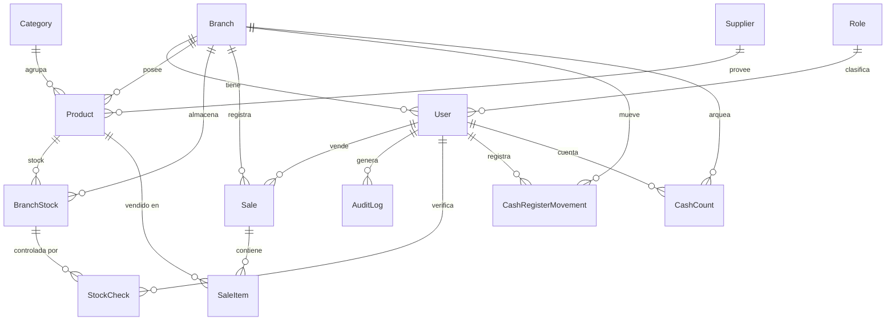

# Auditoría del sistema actual

> Mapa completo del código recuperado desde producción (commit `92d3d65`, agosto 2026).
> Estado del análisis: lectura exhaustiva de los 137 archivos versionados de `src/`, `prisma/`, `scripts/`, `tools/` y configuración.
> Documentos relacionados: [SECURITY_AUDIT.md](SECURITY_AUDIT.md) · [UI_UX_AUDIT.md](UI_UX_AUDIT.md) · [ARCHITECTURE_PROPOSAL.md](ARCHITECTURE_PROPOSAL.md)

---

## 1. Resumen en una página

Kiosco es una aplicación Next.js 15 (App Router) que hoy resuelve **un solo caso de uso completo**: cargar un carrito y registrar una venta. Todo lo demás está a medio construir, duplicado o desconectado.

| Dimensión | Estado |
|---|---|
| Superficie real | 8 páginas, 16 rutas de API, 13 modelos Prisma |
| Código muerto | **19 archivos** (14 % del código fuente) nunca importados |
| Funcionalidad rota en producción | Eliminar venta (405), alta de movimiento de caja (400), export CSV (`alert`) |
| Validación de entrada | **Ninguna** — no hay Zod ni equivalente en ninguna ruta |
| Atomicidad de la venta | **No transaccional** — 4 escrituras independientes |
| Autorización | 3 de 16 rutas verifican rol; el resto solo verifica que exista sesión |
| Tests | **0** |
| Configuración de lint | **Inexistente** (el script `lint` abre un asistente interactivo) |

El sistema **funciona** para una sucursal, un cajero y poco volumen. No resiste ni concurrencia, ni un segundo empleado con intenciones, ni un catálogo grande, ni una segunda sucursal.

---

## 2. Inventario de superficie

### 2.1 Páginas

| Ruta | Archivo | Rol requerido | Qué hace | Estado |
|---|---|---|---|---|
| `/` | `src/app/page.tsx` | público | Landing con logo y botón "Iniciar sesión" | Funciona, pero es una landing de marketing, no un panel |
| `/login` | `src/app/login/page.tsx` | público | Usuario + contraseña | Funciona |
| `/caja` | `src/app/caja/page.tsx` | autenticado | **Punto de venta.** Búsqueda, tabla de productos, carrito, método de pago, confirmación | Funciona; ver bugs en §5 |
| `/ventas` | `src/app/ventas/page.tsx` | autenticado | Lista de movimientos de caja (ayer + hoy) y saldo | Funciona parcialmente; el borrado está roto |
| `/productos` | `src/app/productos/page.tsx` | autenticado | Catálogo con filtros, orden, paginación, alta/edición/baja | Funciona; expone precios a todos |
| `/control/caja` | `src/app/control/caja/page.tsx` | autenticado | Formulario de arqueo (monto contado + notas) | Funciona, pero **no está enlazada desde ningún lado** |
| `/camera` | `src/app/camera/page.tsx` | autenticado | Escáner de cámara que consulta OpenFoodFacts | Funciona, **no enlazada**, no integrada con el catálogo propio |
| `/admin/auditoria` | `src/app/admin/auditoria/page.tsx` | admin (solo en middleware) | Bitácora filtrable por fecha/tabla/acción | Funciona; sin paginación |
| `/admin/sales` | `src/app/admin/sales/page.tsx` | admin (solo en middleware) | Reporte de ventas por rango de fechas | Funciona |
| `/not-found` | `src/app/not-found.tsx` | — | 404 | Funciona |

**No existen** pantallas de: stock, proveedores, compras, clientes, usuarios, sucursales, configuración, reportes más allá de ventas.

### 2.2 Rutas de API

Leyenda de autorización: **A** = verifica sesión · **R** = verifica rol · **S** = filtra por sucursal · **—** = ninguna verificación propia (depende únicamente del middleware).

| Ruta | Métodos | Auth | Observación crítica |
|---|---|---|---|
| `/api/auth/login` | POST | público | Sin límite de intentos |
| `/api/auth/logout` | POST | público | Solo borra la cookie; el token sigue siendo válido |
| `/api/auth/validate` | POST | A | Deja dos `console.log` de depuración |
| `/api/sales` | POST | A·S | **No transaccional. Confía en el precio del cliente. No valida stock.** |
| `/api/sales/[id]` | — | — | **Archivo 100 % comentado.** La UI llama a `DELETE` → 405 |
| `/api/sales/recent` | GET | **—** | Sin auth propia. Devuelve ventas de **todas** las sucursales |
| `/api/cash` | GET·POST | A·S | GET tiene N+1. POST no impacta el saldo. Rango de fechas fijo |
| `/api/cash/[id]` | GET·DELETE | A·S | DELETE es transaccional (bien), pero **borra físicamente** venta e ítems |
| `/api/cash/balance` | GET | A·S | Lee `Branch.currentCash` |
| `/api/cash/count` | POST | A | Registra arqueo; **nunca se compara con lo esperado** |
| `/api/products` | GET·POST·DELETE | A·S | **`DELETE` sin `id` borra todo el catálogo de la sucursal, sin rol** |
| `/api/products/[id]` | GET·PUT·DELETE | A·S | Transaccional. Sin verificación de rol |
| `/api/stock` | GET·POST | **—** | GET devuelve stock de **todas** las sucursales. POST acepta `branchId` arbitrario |
| `/api/stock/[id]` | GET·PUT·PATCH | A·S | La mejor ruta del proyecto: transaccional, valida negativos, audita |
| `/api/categories` | GET·POST | **—** | Sin auth ni rol |
| `/api/roles` | GET·POST | **—** | Sin auth ni rol. Permite crear roles arbitrarios |
| `/api/suppliers` | GET·POST | **—** | Sin auth ni rol |
| `/api/users` | GET·POST | **—** | **GET devuelve el hash de contraseña de todos los usuarios.** POST permite crear un admin |
| `/api/branches` | GET·POST·PATCH·DELETE | A·R·S | Única ruta con control de rol correcto |
| `/api/audit` | GET | A·S | Sin control de rol: un cajero lee toda la bitácora |
| `/api/logs` | GET·POST | **—** | GET expone hashes. **POST permite falsificar la bitácora** |

### 2.3 Componentes

| Directorio | Archivos | Estado |
|---|---|---|
| `components/caja/` | 10 | **En uso** — es la UI del punto de venta |
| `components/productos/` | 7 | **En uso** |
| `components/ventas/` | 10 | **En uso** |
| `components/auditoria/` | 7 | **En uso** |
| `components/admin/sales/` | 6 | **En uso** |
| `components/ui/` | 2 | `Modal`, `Spinner`. En uso |
| `components/cashregister/` | **8** | **CÓDIGO MUERTO** — ninguna página lo importa |
| `components/dashboard/` | **8** | **CÓDIGO MUERTO** — ninguna página lo importa |
| Sueltos | 4 | `Navbar`, `CashControlModal`, `BarcodeScanner` en uso; `ClientAuthCheck` **muerto** |

`cashregister/` y `dashboard/` son dos generaciones anteriores de la misma pantalla de venta que nunca se borraron. Contienen `CartSidebar`, `ProductTable`, `SearchBar`, `CartItem` — nombres idénticos a los de `caja/`, con comportamiento levemente distinto. Es la principal fuente de confusión al leer el proyecto.

### 2.4 Hooks, stores y librerías

| Archivo | Qué hace | Observación |
|---|---|---|
| `hooks/useProducts.ts` | Trae productos y categorías | Refetch completo en cada montaje; sin caché ni deduplicación |
| `store/cart.ts` | Carrito Zustand | **En uso.** Sin persistencia: recargar la página pierde la venta |
| `app/store/cart.ts` | Carrito Zustand | **CÓDIGO MUERTO** — duplicado con lógica distinta (`updateQuantity(0)` elimina, en el otro hace `Math.max(1,…)`) |
| `lib/prisma.ts` | Singleton de Prisma | Correcto |
| `lib/formatCurrency.ts` | Formato ARS | Correcto, pero `ventas/page.tsx` define su propia versión duplicada |
| `lib/utils.ts` | — | 12 líneas |
| `types/` | 4 archivos | `CashMovement` está definido dos veces (`types/index.ts` y `types/caja.ts`) |

---

## 3. Modelo de datos

### 3.1 Diagrama actual

### 3.2 Problemas del esquema

| # | Problema | Modelo | Gravedad |
|---|---|---|---|
| D1 | **`Product.barcode` es `@unique` global y `Product.branchId` es obligatorio.** Dos sucursales no pueden tener el mismo producto: la segunda choca con el índice único. El proyecto es estructuralmente incapaz de escalar a más de una sucursal | `Product` | **Crítica** |
| D2 | **Dinero en `Float`** — `Product.price`, `SaleItem.price`, `CashRegisterMovement.amount`, `CashCount.amount`, `Branch.currentCash`. Errores de redondeo acumulativos en caja | 5 modelos | **Crítica** |
| D3 | **`Branch.currentCash` es un total mutable**, actualizado con leer-modificar-escribir sin transacción. Dos ventas simultáneas pierden una | `Branch` | **Crítica** |
| D4 | **No existe el concepto de turno / sesión de caja.** No hay apertura, ni saldo inicial, ni cierre. `currentCash` crece desde el origen de los tiempos | — | **Crítica** |
| D5 | **`CashCount` (arqueo) no se compara con nada.** Se guarda el monto contado y nunca se calcula la diferencia | `CashCount` | Alta |
| D6 | **No hay libro de movimientos de stock.** `BranchStock.quantity` se muta directamente; el historial solo vive en `AuditLog`, que es texto libre | `BranchStock` | Alta |
| D7 | **La relación venta ↔ pago es una cadena de texto.** El método de pago se recupera parseando `description` con `/Venta\s*#(\d+)/i`. Si alguien edita la descripción, el reporte miente | `CashRegisterMovement` | Alta |
| D8 | `Sale` no guarda `total`, ni número de comprobante, ni estado (anulada/devuelta) | `Sale` | Alta |
| D9 | Borrado físico de `Sale` y `SaleItem` en `/api/cash/[id]` — destruye registros financieros | `Sale` | Alta |
| D10 | `paymentMethod` y `type` son `String` libres, no enums | 2 modelos | Media |
| D11 | `StockCheck` está definido y **nunca se usa**. Su `@@unique([stockId, userId, date])` sobre un `DateTime @default(now())` no restringe nada | `StockCheck` | Media |
| D12 | `Sale.date` y `Sale.createdAt` son dos campos con el mismo default | `Sale` | Baja |
| D13 | Sin `updatedAt` en ningún modelo | todos | Media |
| D14 | Sin índices declarados para las consultas reales (`CashRegisterMovement` por `branchId`+`date`, `AuditLog` por `timestamp`) | 2 modelos | Media |
| D15 | `Product.value Int?` — semántica no documentada; parece ser el costo. Solo lo escribe el seed | `Product` | Media |
| D16 | `Supplier` existe con API, sin ninguna pantalla que lo use | `Supplier` | Media |
| D17 | `AuditLog.changes` guarda snapshots JSON completos del registro. Crecerá sin control y **filtra costos** a quien pueda leer la bitácora | `AuditLog` | Media |

### 3.3 Migraciones

Siete migraciones que **no forman una cadena aplicable**. La séptima (`20250605201717_add_value_to_product`) es en realidad una baseline completa que recrea las 13 tablas. Detalle en [`prisma/migrations/README.md`](../prisma/migrations/README.md).

---

## 4. Autenticación, roles y sucursales

### 4.1 Cómo funciona hoy

1. `POST /api/auth/login` valida usuario y contraseña con `bcrypt.compareSync`.
2. Firma un JWT con `{ userId, role, branchId }`, expiración 1 día.
3. Lo guarda en una cookie `token`: `httpOnly`, `secure` en producción, `sameSite: lax`, `maxAge` 1 día.
4. `middleware.ts` intercepta todo salvo assets y rutas públicas; verifica el token y, **solo para `/admin/*`**, consulta la base para comprobar `role.name === 'admin'`.
5. Cada ruta de API que quiere saber quién es el usuario **vuelve a parsear la cookie por su cuenta**.

### 4.2 Problemas

- **Cuatro implementaciones distintas del mismo helper.** `getUserFromCookie` aparece copiado en `/api/sales`, `/api/cash`, `/api/cash/balance` y `/api/audit` usando `req.headers.get('cookie')` con regex; `getAuth` aparece en `/api/products`, `/api/products/[id]`, `/api/stock/[id]`, `/api/cash/[id]` y `/api/branches` usando `cookies()`. Difieren en el manejo de errores y en qué claims exigen.
- **El rol se verifica en 3 de 16 rutas.** Solo `/api/branches` lo hace bien. La protección de `/admin/*` vive únicamente en el middleware, que protege *las páginas*, no las APIs: `GET /api/audit` y `GET /api/admin/sales` son accesibles para cualquier cajero.
- **El middleware exime cualquier ruta que contenga un punto**: `if (/\.(.*)$/.test(pathname))`. La intención era dejar pasar `.css`/`.png`, pero es una exención de autenticación por patrón, no por tipo de recurso.
- **Roles con nombres inconsistentes.** `prisma/seed.ts` crea `admin` / `vendedor`; `scripts/insertData.ts` crea `Admin` / `Atendedor`. La comparación es sensible a mayúsculas: un usuario con rol `Admin` no pasa el control de `/admin/*`.
- **No hay permisos, solo un booleano `isAdmin`.** No se puede expresar "este encargado puede anular ventas pero no cambiar precios".
- **Sin revocación de sesión.** Cambiar el rol o la sucursal de un usuario no invalida su token; sigue operando con los claims viejos hasta 24 h.
- **Sin recuperación ni cambio de contraseña.** No existe la funcionalidad. La única forma de cambiar una clave es un script contra la base.
- **Sin usuarios deshabilitados.** No hay campo `active`; dar de baja a un empleado exige borrarlo, lo que rompe las claves foráneas de sus ventas.

---

## 5. Análisis por módulo

### 5.1 Ventas — `/caja` + `/api/sales`

**Sirve para:** cargar productos a un carrito y registrar la venta con un método de pago.

**Qué funciona:** el flujo feliz. Lector de código de barras USB, búsqueda con debounce, alta de producto al vuelo si el código no existe, carrito lateral en escritorio y modal en móvil, confirmación previa.

**Qué está roto o incompleto:**

- **La venta no es atómica.** `POST /api/sales` ejecuta, en secuencia y sin `$transaction`: crear `Sale` + `SaleItem`s → crear `CashRegisterMovement` → leer y actualizar `Branch.currentCash` → auditar → recorrer los ítems descontando stock. Si el paso 5 falla (por ejemplo, el producto no tiene fila en `BranchStock` → error `P2025`), la venta y el movimiento de caja **ya quedaron guardados**: hay plata registrada y stock intacto.
- **No valida stock.** Usa `{ decrement: item.quantity }` sin comprobar disponibilidad. El stock queda negativo. El botón "+" del frontend sí lo limita (`disabled={qty >= stock}`), pero eso es solo la UI.
- **Confía en el precio que manda el navegador.** `items[].price` viaja en el body y se escribe tal cual en `SaleItem.price` y en el monto del movimiento de caja. Ver [SECURITY_AUDIT.md](SECURITY_AUDIT.md) §P0-1.
- **El listener global de teclado interfiere con toda la aplicación.** `useEffect` en `caja/page.tsx` engancha `window.addEventListener('keydown')` y acumula **cualquier** tecla alfanumérica en un buffer. Mientras el cajero escribe el nombre de un producto nuevo en el modal, esas teclas también alimentan el buffer del escáner; al presionar Enter se dispara la lógica de código de barras.
- **`SearchBar` roba el foco permanentemente.** `useEffect(() => inputRef.current?.focus())` **sin array de dependencias** se ejecuta en cada render. Cualquier otro campo de la página pierde el foco apenas el componente vuelve a renderizarse.
- **Doble manejo de Enter.** `SearchBar.handleKeyDown` y el listener global procesan la misma pulsación.
- Sin cálculo de vuelto, sin pago combinado, sin descuentos, sin ventas suspendidas, sin devoluciones, sin comprobante, sin reimpresión.
- El carrito no persiste: un F5 o un corte de luz pierde la venta en curso.

**Conservar:** el flujo de escaneo → carrito → confirmación; el alta rápida de producto desde el escáner (es una buena idea para un almacén real).
**Refactorizar:** todo el handler de `/api/sales` (transacción + precios del servidor + validación de stock); el manejo de foco y teclado.
**Eliminar:** nada de este módulo.

### 5.2 Caja — `/ventas`, `/control/caja`, `/api/cash*`

**Sirve para:** ver los movimientos del día y registrar un arqueo.

**Qué funciona:** el listado ordenable con detalle expandible por venta, y el saldo en efectivo.

**Qué está roto o incompleto:**

- **El botón de eliminar venta está doblemente roto.** `MovimientoRow` pasa `saleId={m.id}`, pero `m.id` es el id del **movimiento de caja**, no de la venta. Y `DeleteButton` llama a `DELETE /api/sales/{id}`, cuyo archivo está **íntegramente comentado** → la ruta no existe y Next responde 405. La operación correcta (`DELETE /api/cash/[id]`, que sí está implementada y es transaccional) **no se invoca desde ningún lado**.
- **El modal de nuevo movimiento nunca se abre.** `ventas/page.tsx` declara `isModalOpen` pero no hay ningún botón que lo ponga en `true`. Y si se abriera, fallaría: `NewMovementModal` envía `{amount, paymentMethod, description}` mientras `POST /api/cash` exige además `movementType` → 400.
- **Los movimientos manuales no afectan el saldo.** `POST /api/cash` crea la fila pero nunca toca `Branch.currentCash`. Un retiro de caja se registra y el saldo no baja.
- **No hay apertura ni cierre de caja.** `currentCash` es un acumulador histórico que nunca se reinicia. El "saldo actual" es la suma de todo el efectivo desde que se instaló el sistema.
- **El arqueo no se compara con nada.** `/api/cash/count` guarda el monto contado. Nadie calcula la diferencia contra lo esperado.
- **Dos interfaces para lo mismo.** `/control/caja` (página, sin enlaces) y `CashControlModal` (en el navbar) hacen exactamente lo mismo contra el mismo endpoint.
- **Rango de fechas fijo.** `GET /api/cash` devuelve ayer y hoy, sin parámetros. El texto del estado vacío dice "Ajusta el filtro de fechas o método de pago" — filtros que no existen.
- **N+1 de consultas.** Por cada movimiento se hace un `saleItem.findMany` separado.

**Conservar:** la tabla de movimientos con detalle expandible.
**Refactorizar:** todo el modelo de caja (ver §D4 y la propuesta de `CashSession`).
**Eliminar:** `/control/caja` (duplicado del modal) tras verificar que nadie la use por URL.

### 5.3 Productos — `/productos` + `/api/products*`

**Sirve para:** administrar el catálogo de la sucursal.

**Qué funciona:** filtros por texto y categoría, filtro de stock crítico, ordenamiento por 5 columnas, paginación de 20, métricas de cabecera, alta/edición con modal, borrado con confirmación. Es la pantalla más completa del sistema.

**Qué está roto o incompleto:**

- **Sin control de rol: cualquier cajero puede cambiar precios y borrar productos.**
- **`DELETE /api/products` sin id borra el catálogo entero de la sucursal.** Sin rol, sin confirmación. No lo llama la UI, pero la ruta está expuesta.
- **`NewProductModal` fuerza `categoryId: 1`.** Todo producto creado desde el escáner cae en la categoría con id 1, exista o no.
- **El stock se edita como valor absoluto.** `ProductoModal` calcula `originalStock + addStockAmount` en el cliente y manda el total. Dos usuarios editando a la vez se pisan. Existe `PATCH /api/stock/[id]` con delta atómico, pero la UI no lo usa.
- Sin costo, sin margen, sin proveedor, sin impuestos, sin unidad de medida, sin stock mínimo, sin ubicación, sin imagen, sin historial de precios.
- El campo `value` (posible costo) no se muestra ni se edita en ninguna parte.
- Exportar CSV es un `alert('Función de exportar CSV no implementada.')`.
- Un solo umbral de stock crítico, `< 10`, hardcodeado en tres lugares distintos.
- **Sin paginación en el servidor.** `GET /api/products` trae el catálogo completo con sus stocks; el cliente filtra, ordena y pagina. Con un catálogo grande (el scraper de OpenFoodFacts sugiere miles de artículos) es una descarga de varios MB en cada carga de página **y después de cada venta**.

**Conservar:** la estructura de filtros + métricas + tabla + paginación. Es un buen patrón, hay que moverlo al servidor.
**Refactorizar:** paginación y filtrado en la API; edición de stock por delta; control de rol.

### 5.4 Stock — solo API

**No hay pantalla de stock.** Existen dos rutas:

- `GET/POST /api/stock` — **sin autenticación propia.** El GET devuelve el stock de todas las sucursales con producto y sucursal incluidos. El POST acepta `branchId` y `productId` arbitrarios del body e incrementa la cantidad. Es la ruta más peligrosa del proyecto junto con `/api/users`.
- `GET/PUT/PATCH /api/stock/[id]` — **la mejor ruta del código**: valida pertenencia a la sucursal, es transaccional, rechaza resultados negativos, audita. Nada la usa.

**Eliminar:** `/api/stock` (la raíz).
**Conservar:** `/api/stock/[id]` como base del futuro módulo de inventario.

### 5.5 Auditoría — `/admin/auditoria` + `/api/audit`, `/api/logs`

**Sirve para:** ver qué cambió, quién lo hizo y cuándo.

**Qué funciona:** la escritura de la bitácora es sorprendentemente consistente — casi todas las mutaciones dejan registro con `before`/`after` y `origin`. La pantalla filtra por fecha, tabla y acción, con tres secciones.

**Qué está roto o incompleto:**

- **`POST /api/logs` acepta cualquier objeto y lo escribe en la bitácora.** Sin autenticación propia, sin validación. Permite falsificar entradas atribuidas a otro usuario.
- **`GET /api/logs` devuelve `include: { user: true }`** — el objeto completo, con el hash de contraseña.
- **`GET /api/audit` no verifica rol.** Un cajero puede leer toda la bitácora de su sucursal, incluidos los snapshots de `Product` con el campo `value`.
- **Sin paginación ni límite.** Trae todos los registros históricos de la sucursal en una sola respuesta.
- La bitácora es apéndice, no fuente de verdad: se puede borrar una venta y el `AuditLog` queda huérfano apuntando a un `recordId` inexistente.
- `AuditLog.actionType` recibe `'create'` desde las APIs y `'CREATE'` desde el seed; la pantalla filtra por minúsculas.

**Conservar:** la disciplina de auditar cada mutación con `before`/`after`.
**Refactorizar:** centralizar la escritura en un helper; paginar; restringir por rol.
**Eliminar:** `/api/logs` completo.

### 5.6 Reporte de ventas — `/admin/sales`

**Qué funciona:** rango de fechas, métricas y tabla con ítems expandibles.

**Qué está incompleto:**

- El método de pago se obtiene parseando la descripción del movimiento de caja. Si no hay coincidencia, asume `'efectivo'` silenciosamente (`paymentMap[s.id] ?? 'efectivo'`). El reporte puede estar mintiendo.
- `GET /api/admin/sales` **no verifica rol** pese a estar bajo `/api/admin/`.
- Sin agrupaciones (por hora, por cajero, por producto), sin margen, sin exportación.

### 5.7 Sucursales — solo API

`/api/branches` es la única ruta con autorización correcta: verifica rol admin en POST, PATCH y DELETE, y en GET devuelve todas las sucursales al admin o solo la propia al resto. **No hay pantalla.**

### 5.8 Usuarios — solo API

`/api/users` **no tiene ninguna verificación propia**:

- `GET` devuelve todos los usuarios con `include: { role, branch }` — y como no hay `select`, incluye el campo `password` con el hash bcrypt.
- `POST` hace `prisma.user.create({ data: { ...data, password: hashed } })` — asignación masiva: el cliente elige `roleId` y `branchId`. Cualquier sesión válida puede crearse un administrador.

**No hay pantalla.** La gestión de usuarios se hace hoy con `scripts/insertUsers.ts`.

### 5.9 PWA y service worker

- `next-pwa` genera `public/sw.js` en cada build (aparece como cambio sin commitear; conviene ignorarlo o versionarlo deliberadamente).
- **El service worker cachea `/api/*`** con estrategia `NetworkFirst`, excluyendo solo `/api/auth/`. Respuestas autenticadas —catálogo con precios, movimientos de caja— quedan en `CacheStorage` y sobreviven al logout.
- `manifest.json` describe otra aplicación: *"Kiosco Argentino — Escanea y consulta productos argentinos"*, `start_url: "/"` (la landing, no la caja).
- Sin estrategia offline real: la venta requiere red. Para un almacén, poder vender con internet caído es un requisito, no un lujo.

### 5.10 Integraciones

- **OpenFoodFacts** — `BarcodeScanner.tsx` consulta la API pública al escanear. La página `/camera` que lo usa no está enlazada y el resultado no se vuelca al catálogo propio.
- **`tools/scrap.py`** — scraper que vuelca productos a una base `openfood` separada. Fuera del ciclo de la aplicación.
- **`test.js`** en la raíz del repositorio: script destructivo que hace `deleteMany()` de `stockCheck`, `saleItem`, `branchStock` y `product` sin ninguna guarda de entorno, y reinserta desde un `cleaned_products.txt` que **no está en el repositorio**. Un `node test.js` accidental contra producción vacía el catálogo y el historial de ítems vendidos.

---

## 6. Código muerto y duplicado

### 6.1 Nunca importado (19 archivos)

| Archivo | Motivo |
|---|---|
| `src/components/cashregister/` (8 archivos) | Generación anterior de la pantalla de venta |
| `src/components/dashboard/` (8 archivos) | Generación anterior del panel |
| `src/app/store/cart.ts` | Duplicado de `src/store/cart.ts` con lógica divergente |
| `src/components/ClientAuthCheck.tsx` | Reemplazado por `middleware.ts` |
| `src/app/api/sales/[id]/route.ts` | 192 líneas dentro de un bloque de comentario |
| `test.js` | Script destructivo suelto en la raíz |

### 6.2 Duplicado real

| Concepto | Dónde |
|---|---|
| Helper de autenticación | 9 rutas, 2 implementaciones, 4 variantes |
| Carrito Zustand | `store/cart.ts` + `app/store/cart.ts` |
| `formatCurrency` | `lib/formatCurrency.ts` + copia local en `ventas/page.tsx` |
| Tipo `CashMovement` | `types/index.ts` + `types/caja.ts` |
| Formulario de arqueo | `/control/caja` + `CashControlModal` |
| Scripts de datos | `.js` y `.ts` de `seed`, `insertData`, `insertCategories`, `insertUsers` |
| Umbral de stock crítico `< 10` | 3 archivos |

### 6.3 Configuración inerte

- **`tailwind.config.js` no se aplica.** El proyecto usa Tailwind 4 (`@import "tailwindcss"` + `@tailwindcss/postcss`), que ignora los archivos de configuración JavaScript salvo que se los cargue explícitamente con `@config`. `globals.css` no lo hace. En consecuencia: la paleta personalizada (`primary`, `card`, `border`…), la tipografía Inter y `darkMode: 'class'` **no existen en el CSS final**. Los `dark:` del código responden a la preferencia del sistema operativo y no se pueden alternar.
- `globals.css` usa `theme('fontFamily.sans')`, sintaxis de Tailwind 3.
- No hay configuración de ESLint. El script `lint` ejecuta `next lint`, que al no encontrar configuración abre un asistente interactivo — inutilizable en CI.
- `next.config.ts` tiene `experimental: {}` vacío y **ningún encabezado de seguridad**.

### 6.4 Dependencias declaradas y no usadas

| Paquete | Uso real | Nota |
|---|---|---|
| `next-auth` | **0 archivos** | Es la **única vulnerabilidad crítica** del proyecto. Se puede desinstalar |
| `@faker-js/faker` | 0 archivos | |
| `lucide-react` | 0 archivos | Se usa `@heroicons/react` |
| `react-icons` | 0 archivos | |
| `ts-node` | 0 | Se usa `tsx` |
| `@types/eslint`, `@types/estree`, `@types/trusted-types` | — | Tipos sin la librería correspondiente |
| `@prisma/client` | intensivo | **Está en `devDependencies`** siendo una dependencia de ejecución |

---

## 7. Rendimiento

| # | Problema | Impacto |
|---|---|---|
| P1 | `GET /api/products` devuelve el catálogo completo sin paginar, y `caja/page.tsx` lo vuelve a pedir **después de cada venta** | En hora pico, con catálogo grande, cada venta dispara una descarga de varios MB |
| P2 | `GET /api/cash` hace N+1: un `saleItem.findMany` por movimiento | Con 200 movimientos diarios son 201 consultas |
| P3 | `GET /api/audit` sin límite ni paginación | Crece sin techo; terminará colgando el navegador |
| P4 | El layout raíz ejecuta `jwt.verify` + `prisma.user.findUnique` en **cada** petición renderizada | Una consulta extra por navegación |
| P5 | `middleware.ts` consulta la base en cada request a `/admin/*` | Round-trip adicional por request |
| P6 | Todas las rutas con `dynamic = 'force-dynamic'`; sin caché ni revalidación | Nada se reutiliza |
| P7 | Sin índices en `CashRegisterMovement(branchId, date)` ni `AuditLog(timestamp)` | Escaneos completos al crecer |
| P8 | `useProducts` refetch completo en cada montaje, sin caché compartida | El catálogo se descarga de nuevo al cambiar de pantalla |

---

## 8. Mantenibilidad

**A favor:** TypeScript en modo `strict`; componentes chicos y bien separados; disciplina de auditoría; nombres en español coherentes con el dominio; el proyecto compila y construye sin errores.

**En contra:**

- 35 usos de `: any`, concentrados en los `catch (e: any)` de las rutas.
- Comentarios de encabezado incorrectos: `ventas/page.tsx` dice `// src/app/caja/page.tsx`; `api/sales/[id]/route.ts` dice `// src/app/api/cash/[id]/route.ts`.
- Nomenclatura confusa: `/caja` es el punto de venta, `/ventas` es el control de caja, `/control/caja` es el arqueo.
- Tipos de Prisma reescritos a mano en anotaciones inline de `.map()` en lugar de inferirlos.
- Sin capa de dominio: las reglas de negocio viven dentro de los route handlers.
- Sin validación de entrada en ninguna ruta.
- Sin tests, sin lint, sin CI, sin hooks de git.
- Sin manejo de errores centralizado: cada ruta arma su propia respuesta y varias filtran mensajes internos.
- Estilos con clases Tailwind repetidas literalmente (los objetos de `toast` con 8 propiedades de estilo aparecen copiados en 6 archivos).

---

## 9. Veredicto por módulo

| Módulo | Conservar | Refactorizar | Eliminar |
|---|---|---|---|
| Venta (`/caja`) | Flujo escaneo→carrito→confirmación; alta rápida de producto | `POST /api/sales` completo; foco y teclado | — |
| Caja | Tabla de movimientos con detalle | Modelo entero (turnos, apertura/cierre, arqueo con diferencia) | `/control/caja`; `NewMovementModal` roto |
| Productos | Patrón filtros+métricas+tabla+paginación | Mover al servidor; rol; stock por delta | — |
| Stock | `/api/stock/[id]` | Construir la pantalla que falta | `/api/stock` (raíz) |
| Auditoría | Disciplina `before`/`after` | Centralizar, paginar, restringir por rol | `/api/logs` |
| Reportes | Rango de fechas + métricas | Vincular pago a venta por FK, no por texto | — |
| Sucursales | `/api/branches` (referencia de cómo hacerlo bien) | Construir la pantalla | — |
| Usuarios | — | Reescribir por completo | `/api/users` tal como está |
| PWA | Instalabilidad | Excluir APIs privadas del caché; manifest real | — |
| Auth | Cookie httpOnly + JWT | Helper único, permisos granulares, revocación | — |
| Código muerto | — | — | 19 archivos (§6.1) |
| Dependencias | — | — | `next-auth`, `faker`, `lucide-react`, `react-icons`, `ts-node` |
