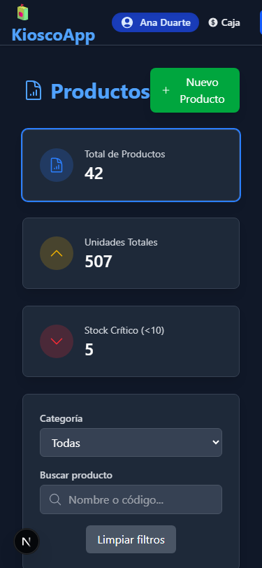
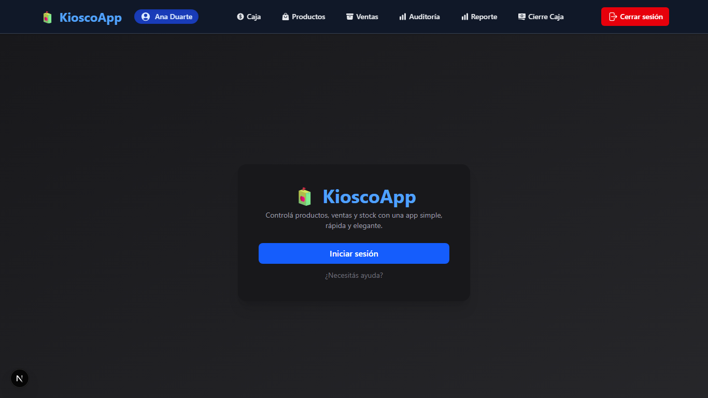
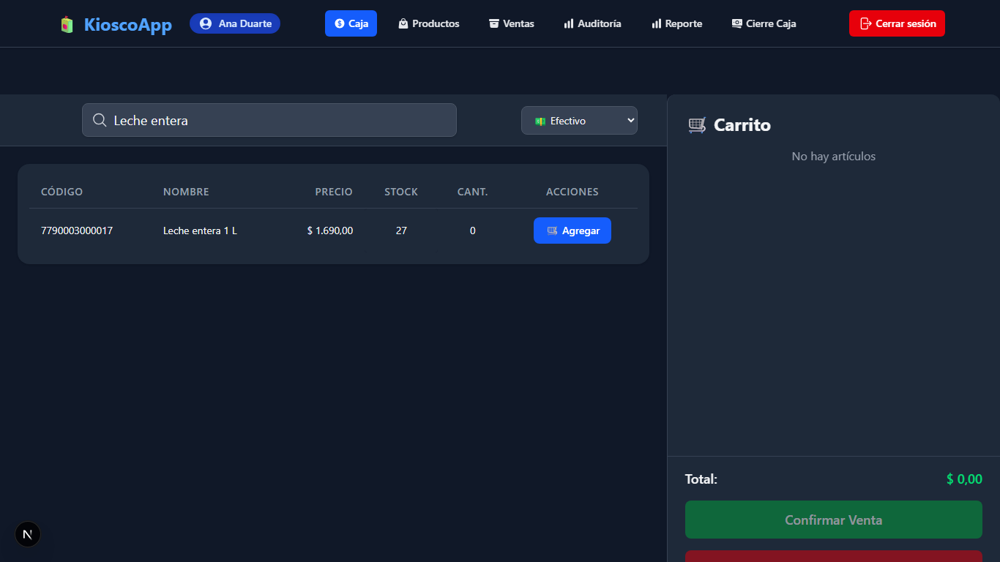
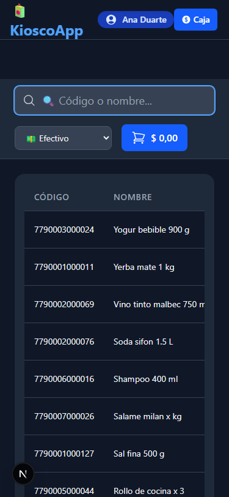
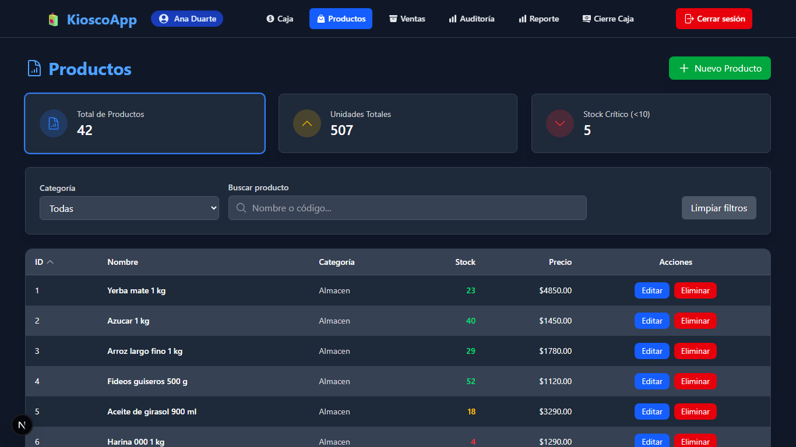
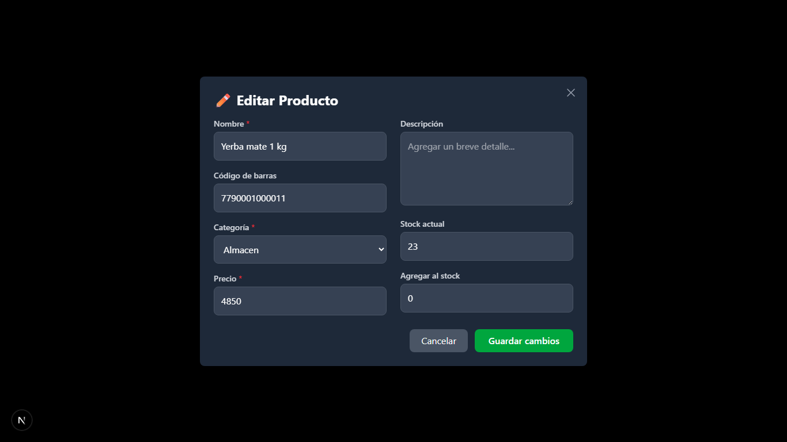
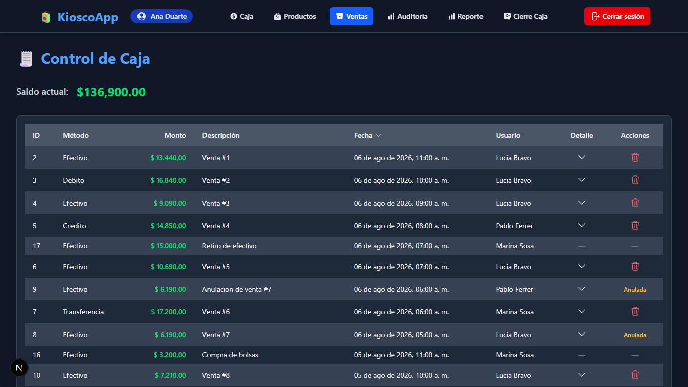
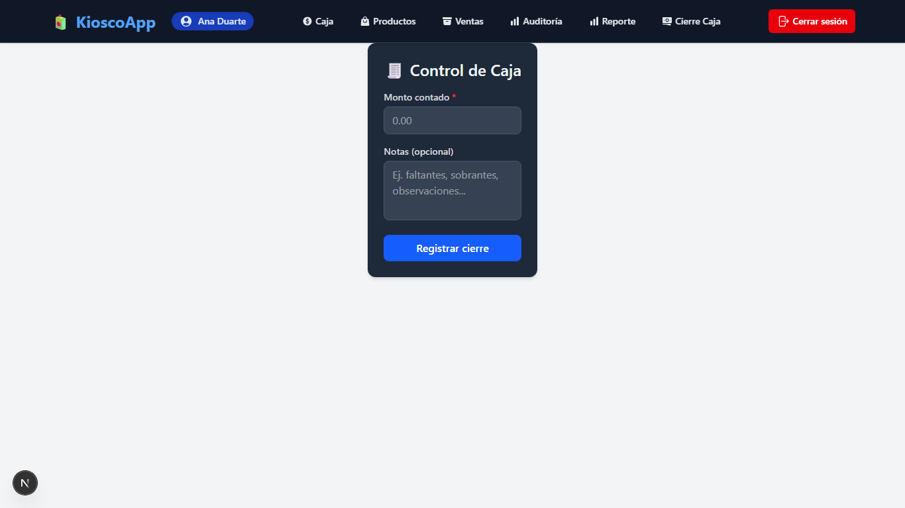
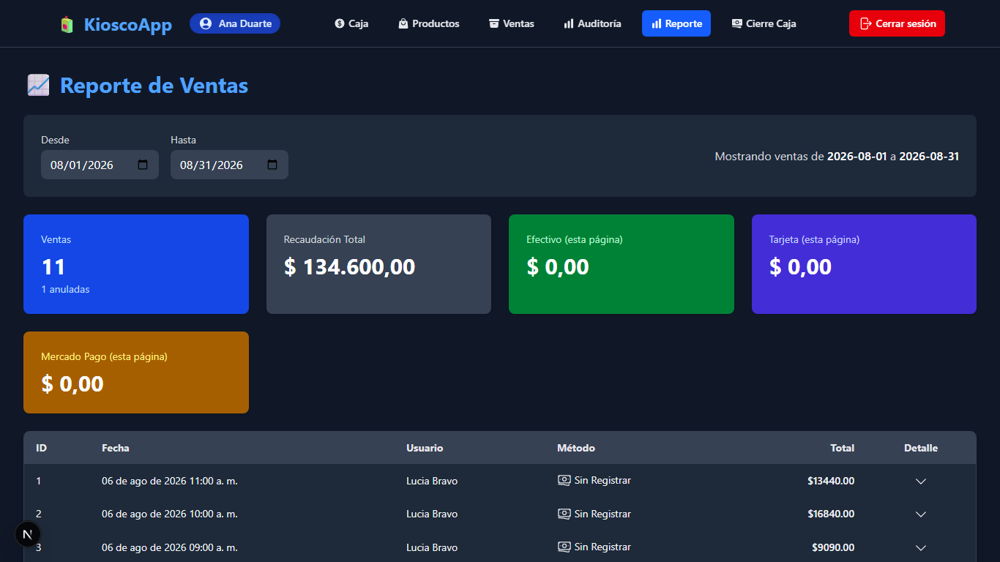
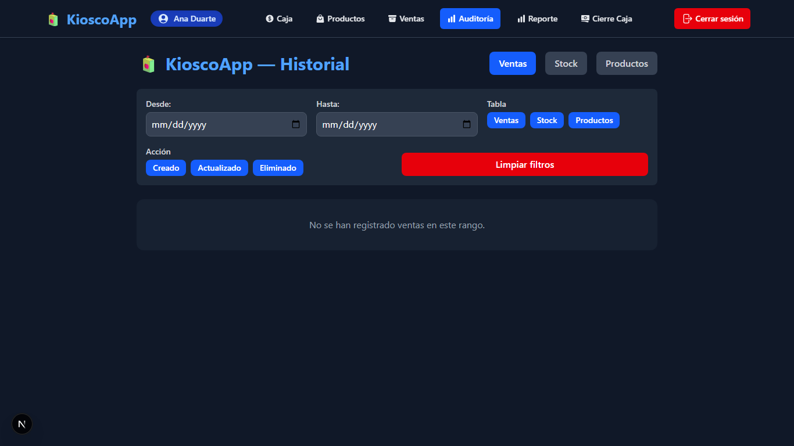

# Estado visual antes de la Fase 2

Recorrido completo de la aplicación sobre la base local `kiosco_dev` con datos
ficticios (`npm run seed:demo`), en los cuatro tamaños que hay que soportar.

Las capturas están en [screenshots/phase2-before/](screenshots/phase2-before/)
y las mediciones en [metrics/phase2-before.json](metrics/phase2-before.json).

> Ningún dato de este documento sale de la realidad. Los productos, precios,
> usuarios y ventas los genera `prisma/seed-demo.ts`.

## Cómo se reprodujo

```bash
npm run seed:demo          # DATABASE_URL apuntando a kiosco_dev
npm run dev
npm run screenshots -- before
npm run ui:metrics -- before
```

## Lo primero: la aplicación no arrancaba

Antes de poder capturar nada hubo que arreglar un fallo que dejaba **toda la
API respondiendo 500 en el navegador**.

`handler()` hacía `await args.params` sin comprobar nada. Next solo pasa
`params` a las rutas con segmento dinámico; a las demás —que son casi todas—
las llama con el segundo argumento ausente. `Object.entries(undefined)`
lanzaba, y el envoltorio lo traducía a `INTERNAL`.

```
POST /api/auth/login 500
TypeError: Cannot convert undefined or null to object
    at normalizarParams (src/server/http/handler.ts:68)
```

Las 354 pruebas no lo veían porque `tests/helpers/http.ts` construía siempre
un `params` vacío: probaba una forma de llamada que en ejecución no ocurre
nunca. Es el caso de manual de una prueba que verifica el ayudante y no el
sistema.

Corregido en `src/server/http/handler.ts`. El ayudante ahora omite el segundo
argumento salvo que la prueba declare parámetros, con lo que toda la suite
pasó a ejercitar la forma real, y `tests/integration/route-args.test.ts` fija
las dos maneras en que Next invoca un handler.

## Mediciones

| Medición                                     | Valor                                                       |
| -------------------------------------------- | ----------------------------------------------------------- |
| Peticiones a `/api/*` al abrir la caja       | 2                                                           |
| Peticiones a `/api/*` por búsqueda           | 1                                                           |
| Rutas con scroll horizontal a 375 px         | 7 de 7                                                      |
| Rutas con scroll horizontal a 768 px         | 7 de 7                                                      |
| Rutas con scroll horizontal a 1366 y 1920 px | 0                                                           |
| Objetivos táctiles por debajo de 44 px       | 164 (375 px) · 158 (768 px) · 179 (escritorio)              |
| Objetivo táctil más chico                    | 20 px                                                       |
| Ancho de la navegación a 375 px              | 375 px, pero envuelve en dos filas y se superpone al título |
| `div` clickeables sin ser `button`           | 0                                                           |
| Campos de formulario sin etiqueta accesible  | 7                                                           |

Las peticiones ya estaban bien: la Fase 1 sacó la descarga del catálogo
completo. Ese número no debe empeorar.

## Problemas por pantalla

### Navegación (todas las pantallas)



- Barra superior única, con **todos los enlaces visibles para todos los
  roles**. No se filtra por permiso: un repositor ve "Cierre Caja" y
  "Auditoría", y solo se entera de que no puede al recibir un 403.
- A 375 px la barra envuelve en dos filas y el logo queda **encima del título
  de la pantalla**.
- El nombre del usuario es un botón sin menú: no hay forma de ver la sucursal
  activa ni el rol.
- "Cerrar sesión" es un botón rojo permanente, del mismo peso visual que
  "Caja". Una acción que se usa una vez por turno compite con la que se usa
  cien veces.
- Ocho elementos en la barra sin ninguna agrupación: operación, catálogo y
  administración mezclados.

### Inicio (`/`)



- Es una **portada de producto**, no un panel de trabajo. A un usuario con la
  sesión abierta le ofrece "Iniciar sesión".
- "¿Necesitás ayuda?" abre un `alert()` del navegador con una dirección de
  correo inventada.
- Cero información operativa: ni caja, ni ventas del día, ni stock bajo.

### Login (`/login`)

- Dos campos sin etiqueta visible ni `label` asociado: solo `placeholder`.
- No hay forma de mostrar la contraseña.
- No avisa cuando la sesión venció ni cuando el usuario fue desactivado.
- El bloqueo por intentos existe en el servidor pero la pantalla no lo
  explica.
- Sin identidad: título en azul sobre tarjeta gris, igual que cualquier
  plantilla.

### Venta (`/caja`)



Es la pantalla más usada y la que peor está.

- La zona principal la ocupa una **tabla de resultados de búsqueda**. Con un
  solo resultado, el 80 % del espacio queda vacío.
- Para agregar un producto hay que buscar, leer la fila y **hacer clic en un
  botón "Agregar"**. No se puede agregar con el teclado.
- El carrito de la derecha ocupa un cuarto del ancho y está vacío casi
  siempre; el total queda al pie, y en 768 px se va abajo del pliegue.
- El selector de medio de pago está arriba, lejos del botón de cobro.
- No hay atajos de teclado. Ni buscar, ni cobrar, ni modificar cantidad.
- Cantidad "0" en la fila del producto: un campo que no hace nada hasta que se
  agrega el producto.
- **A 375 px la tabla se corta**: se ven CÓDIGO y NOMBRE, y precio, stock y el
  botón de agregar quedan fuera de pantalla. El total no se ve nunca.



- El escáner de cámara vive en una pantalla aparte (`/camera`), no en la caja.
- El carrito no sobrevive a un F5.

### Productos (`/productos`)



- Tres tarjetas de métricas ocupan el primer tercio de la pantalla. En móvil
  empujan la tabla completamente fuera del pliegue.
- Precios con formato de programador: `$4850.00`, con punto decimal y sin
  separador de miles. En la misma aplicación, otra pantalla escribe
  `$ 134.600,00`.
- "Eliminar" es un botón rojo **pegado a "Editar"**, del mismo tamaño, en cada
  fila. Es la acción destructiva más fácil de tocar por accidente de todo el
  sistema.
- Sin filtro por estado ni por rango de stock. Sin estado vacío propio.
- A 375 px la tabla desborda y "Nuevo Producto" se superpone al título.

### Edición de producto



- El fondo del diálogo es **negro opaco**: la pantalla de atrás desaparece.
- El precio es un campo más, editable por cualquiera con `products.update`.
  Un repositor que puede corregir un nombre puede cambiar un precio.
- **"Agregar al stock" está dentro del formulario de edición**, sin motivo y
  sin separación. Un ajuste de inventario y una corrección de descripción se
  guardan con el mismo botón.
- Faltan proveedor y estado activo.
- El foco no queda atrapado en el diálogo y no vuelve al abridor al cerrar.

### Caja (`/ventas`)



- **Todos los montos en verde**, ingresos y egresos por igual. "Retiro de
  efectivo" de $15.000 y "Venta #1" de $13.440 se ven idénticos. El tipo de
  movimiento no se distingue por nada más que leer la descripción.
- El vínculo con la venta se muestra como texto `Venta #1` dentro de la
  descripción.
- Hay un **ícono de papelera por fila**, incluso en movimientos que son
  contrapartida de una venta.
- "Saldo actual" es el acumulado histórico de la sucursal. No se advierte en
  ningún lado que no es un turno de caja.
- Sin filtros de fecha, tipo ni usuario. Sin paginación visible.

### Arqueo (`/control/caja`)



- **La página tiene fondo blanco.** Nunca se le puso color, así que hereda el
  del navegador mientras el resto del sistema es oscuro.
- La tarjeta está centrada arriba, con dos tercios de pantalla vacíos.
- Pide "Monto contado" **sin mostrar el saldo esperado**: se cuenta a ciegas.
- No calcula ni muestra la diferencia.
- No hay historial de arqueos anteriores.

### Ventas (`/admin/sales`)



- **"Método: Sin Registrar" en todas las filas** y las tarjetas de Efectivo,
  Tarjeta y Mercado Pago en `$ 0,00`, con ventas que sí tienen medio de pago
  cargado. La pantalla no lee el medio de pago que existe en la base.
- Cinco tarjetas en cinco colores saturados distintos (azul, gris, verde,
  violeta, naranja) sin que el color signifique nada.
- Dos formatos de dinero en la misma pantalla: `$ 134.600,00` en las tarjetas
  y `$13440.00` en la tabla.
- No hay columna de estado: una venta anulada no se distingue de una vigente.
- No se puede anular desde acá, ni buscar por número, ni filtrar por usuario,
  estado o medio de pago.

### Auditoría (`/admin/auditoria`)



- **Dice "No se han registrado ventas en este rango"** con la bitácora
  cargada. El filtro por defecto no encuentra lo que hay.
- El selector de tabla está **duplicado**: arriba a la derecha y otra vez
  dentro del panel de filtros.
- Los tres botones de acción (Creado / Actualizado / Eliminado) se ven todos
  activos a la vez: el estado seleccionado no se distingue.
- "Limpiar filtros" es un botón rojo a ancho completo. El rojo es para
  destruir, no para limpiar un filtro.
- No muestra `requestId`, ni sucursal, ni resultado, ni motivo — campos que la
  Fase 1 agregó a la tabla y que nadie puede ver.
- No hay visor antes/después: el detalle no se abre.
- Sin paginación.

### Usuarios

**No existe.** Hay `/api/users` con altas, bajas y cambios de rol, y ninguna
pantalla que lo use. La administración de usuarios se hace hoy por API.

## Duplicación de componentes

Tres árboles de componentes casi idénticos para la misma pantalla de caja:

```
src/components/caja/          SearchBar, ProductTable, ProductRow, CartSidebar,
                              CartItemRow, CartButton, MobileCartModal, ...
src/components/cashregister/  SearchBar, ProductTable, ProductRow, CartSidebar,
                              CartItem, CartMobile, CartFooter, CartButtonMobile
src/components/dashboard/     SearchBar, ProductCard, CartModal, CartItemRow,
                              StatsPanel, RecentSales, CashRegisterHeader
```

Solo `caja/` está en uso. Los otros dos son copias abandonadas: 15 archivos
que compilan, se revisan en cada lint y no los ejecuta nadie.

Hay además dos almacenes de carrito: `src/app/store/cart.ts` y
`src/store/cart.ts`.

## Resumen de lo que hay que cambiar

| Problema                                             | Objetivo de la Fase 2      |
| ---------------------------------------------------- | -------------------------- |
| API caída en el navegador                            | Corregido antes de empezar |
| Sin sistema visual: colores y espaciado por pantalla | 2                          |
| Navegación sin permisos, rota en móvil               | 3                          |
| Login sin identidad ni avisos                        | 4                          |
| Inicio inútil                                        | 5                          |
| Caja lenta, sin teclado, cortada en móvil            | 6                          |
| Cobro sin vuelto ni protección de doble envío        | 7                          |
| Precio editable por cualquiera; stock mezclado       | 8 y 12                     |
| Caja sin distinguir ingreso de egreso                | 9                          |
| Ventas sin medio de pago ni estado                   | 10                         |
| Auditoría que no muestra la auditoría                | 11                         |
| Usuarios sin pantalla                                | 12                         |
| 179 objetivos táctiles chicos, 7 campos sin etiqueta | 13                         |
| Scroll horizontal en 7 de 7 rutas a 375 y 768 px     | 14                         |
| 15 componentes duplicados sin uso                    | limpieza transversal       |
