# Fase 2 — antes y después

Comparación del rediseño, con capturas reales de las mismas pantallas, la
misma base de datos ficticios y los mismos cuatro tamaños.

- Antes: [screenshots/phase2-before/](screenshots/phase2-before/) · problemas en [PHASE2_UI_BASELINE.md](PHASE2_UI_BASELINE.md)
- Después: [screenshots/phase2-after/](screenshots/phase2-after/)
- Mediciones: [metrics/phase2-before.json](metrics/phase2-before.json) · [metrics/phase2-after.json](metrics/phase2-after.json)

```bash
npm run seed:demo
npm run dev
npm run screenshots -- after
npm run ui:metrics -- after
```

## Lo medido

| Medición                                | Antes      | Ahora                  |
| --------------------------------------- | ---------- | ---------------------- |
| Rutas con scroll horizontal a 375 px    | **7 de 7** | **0**                  |
| Rutas con scroll horizontal a 768 px    | **7 de 7** | **0**                  |
| Objetivos táctiles bajo 44 px a 375 px  | **164**    | **0**                  |
| Objetivo táctil más chico a 375 px      | 20 px      | **44 px**              |
| Campos sin etiqueta accesible           | 7          | **0**                  |
| `div` clickeables en vez de `button`    | 0          | 0                      |
| Peticiones a `/api/*` al abrir la venta | 2          | 3                      |
| Peticiones a `/api/*` por búsqueda      | 1          | 1                      |
| Clics para completar una venta          | 5          | **0** (escanear + F12) |
| Pantallas que existen                   | 8          | 12                     |

La única que sube es la tercera de la lista de peticiones, y por una razón
concreta: la cabecera muestra el saldo de caja, que antes había que ir a
buscar a otra pantalla. Una consulta más al abrir, a cambio de no navegar.

Los 8 objetivos por debajo de 44 px que quedan a 768 px y más son dos botones
secundarios —copiar un identificador y ver más campos— dentro de un detalle
ya abierto. Están documentados en `Button.tsx` y la prueba de extremo a
extremo comprueba que a 375 px no quede ninguno.

## Lo que pesa cada pantalla

Medido con `next build` en las dos ramas. La columna «antes» sale de compilar
`feat/almacen-phase1-foundation` en un árbol de trabajo aparte; los nombres de
ruta cambiaron —antes `/caja` era la pantalla de vender y `/ventas` era la de
la caja registradora—, así que la tabla empareja por lo que hace cada una, no
por su URL.

| Pantalla             | Antes                   | Ahora              |
| -------------------- | ----------------------- | ------------------ |
| Vender               | 116 kB (`/caja`)        | 170 kB (`/venta`)  |
| Caja registradora    | 130 kB (`/ventas`)      | 165 kB (`/caja`)   |
| Historial de ventas  | 107 kB (`/admin/sales`) | 165 kB (`/ventas`) |
| Auditoría            | 107 kB                  | 183 kB             |
| Productos            | 150 kB                  | 166 kB             |
| Inicio               | 107 kB                  | 183 kB             |
| Login                | 109 kB                  | 163 kB             |
| Lector de cámara     | 218 kB (ruta `/camera`) | se carga aparte    |
| Compartido por todas | 102 kB                  | 104 kB             |
| **La más pesada**    | **218 kB**              | **186 kB**         |

**Sube, y hay que decirlo.** Cada pantalla pesa entre 15 y 75 kB más porque
pasó de una tabla desnuda a diálogos con foco atrapado, menús accesibles,
avisos y estados de carga y de error. Eso es Headless UI más la biblioteca de
componentes, y se paga una sola vez: lo compartido subió 2 kB.

Lo que sí bajó es el techo. El lector de cámara era una **ruta entera de
218 kB** que había que visitar para escanear; ahora `EscanerCamara` hace
`import('@zxing/browser')` cuando se abre, así que quien vende con lector de
mano —la mayoría— nunca lo descarga. La pantalla más pesada del sistema pasó
de 218 kB a 186 kB.

## Las pantallas

### Venta

| Antes                                                       | Ahora                                                      |
| ----------------------------------------------------------- | ---------------------------------------------------------- |
|  | 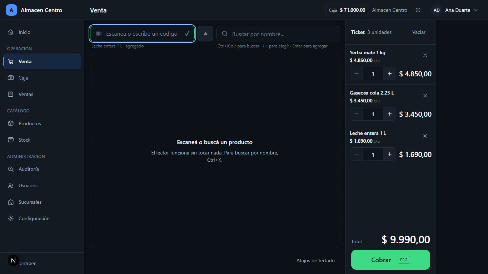 |

La pantalla más usada y la que peor estaba. Antes: buscar, leer la fila,
apuntar y hacer clic en «Agregar», por cada producto. El carrito ocupaba un
cuarto del ancho y estaba casi siempre vacío. No había ni un atajo de teclado.

Ahora el foco arranca en el campo de código, así que **el lector funciona sin
tocar nada**. Escanear, escanear, F12. El ticket vive en el layout, fuera del
área que se desplaza: el total y el botón de cobro no se pierden de vista con
seis productos ni con veinte.

| Antes (375 px)                                     | Ahora (375 px)                                    |
| -------------------------------------------------- | ------------------------------------------------- |
|  | 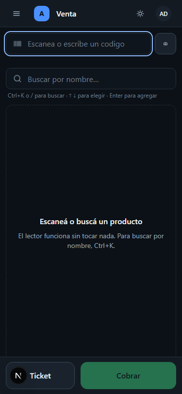 |

En el teléfono, antes se veían dos columnas de la tabla —código y nombre— y
precio, stock y el botón de agregar quedaban fuera de pantalla. El total no
se veía nunca. Ahora hay una barra fija abajo con el total y el cobro, y el
ticket se abre en un cajón.

### Cobro

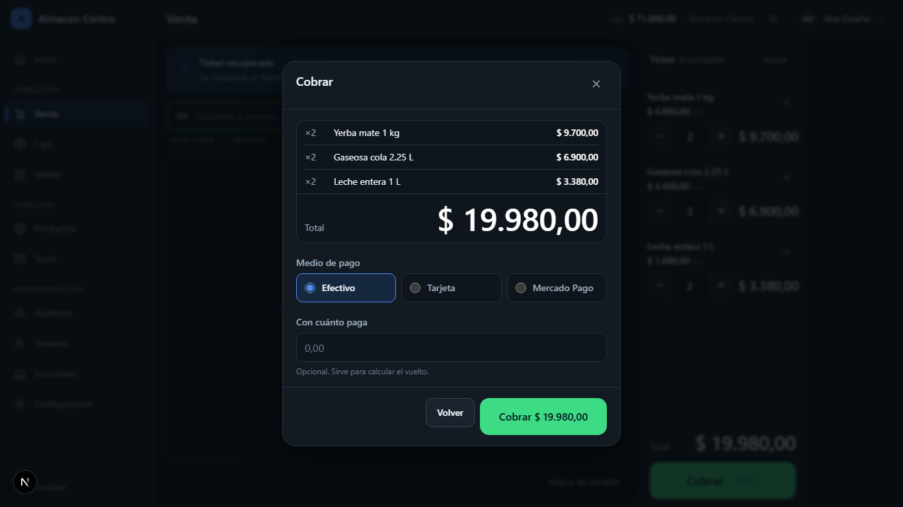

Resumen, total grande, medio de pago, con cuánto paga y vuelto calculado
mientras se escribe. Al terminar: número de venta, total, medio, vuelto y
«nueva venta», que vacía el ticket y devuelve el foco al lector.

**No hay pago combinado.** El modelo guarda un solo `paymentMethod` por venta,
así que ofrecerlo sería un botón que miente. Queda para la Fase 3.

### Inicio

| Antes                                          | Ahora                                         |
| ---------------------------------------------- | --------------------------------------------- |
|  | 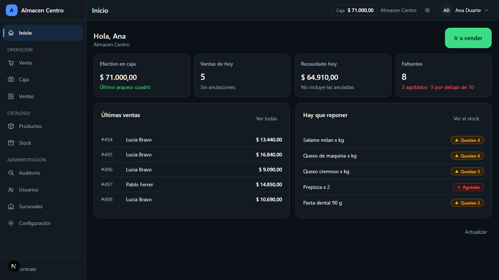 |

Antes era una portada de producto que le ofrecía «Iniciar sesión» a alguien
que ya tenía la sesión abierta, y un `alert()` con un correo inventado.

Ahora: caja, ventas del día, recaudado y faltantes, cada tarjeta abre su
pantalla, y **solo se consulta lo que ese usuario puede ver**. Un cajero no ve
la recaudación; un repositor ve el stock y nada más.

### Caja

| Antes                                        | Ahora                                       |
| -------------------------------------------- | ------------------------------------------- |
|  | 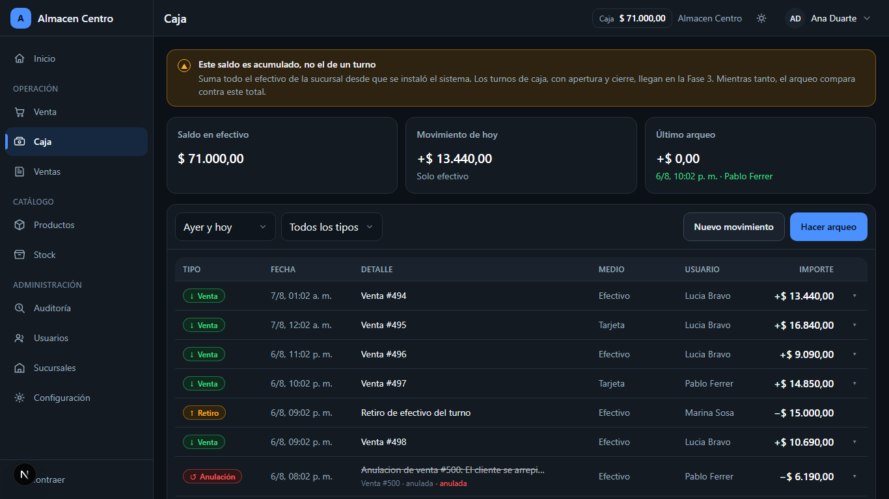 |

Antes **todos los importes salían en verde**: un retiro de $15.000 y una venta
de $13.440 se veían idénticos, y el tipo de movimiento no figuraba en ninguna
columna. Ahora cada tipo trae glifo y palabra, los egresos llevan el signo
escrito, y el arqueo se hace desde la misma pantalla.

La advertencia de que `currentCash` es un acumulado y no un turno está arriba
de todo, no en una nota al pie.

### Arqueo

| Antes                                          | Ahora                                         |
| ---------------------------------------------- | --------------------------------------------- |
|  | 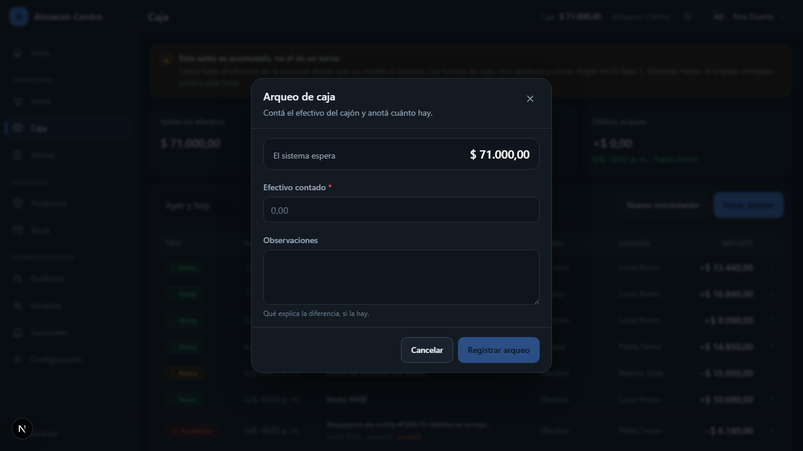 |

La pantalla anterior tenía **fondo blanco** —nunca se le puso color— y pedía
«Monto contado» sin mostrar contra qué. Ahora muestra el saldo esperado antes
de contar y la diferencia mientras se escribe.

### Ventas

| Antes                                          | Ahora                                         |
| ---------------------------------------------- | --------------------------------------------- |
|  | 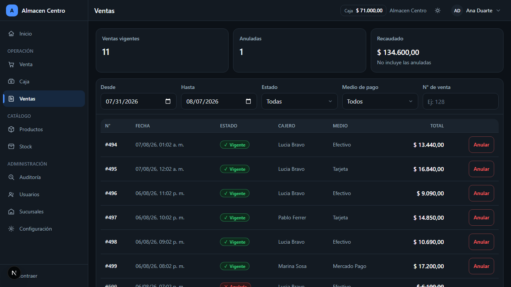 |

Antes decía **«Método: Sin Registrar» en todas las filas** y las tarjetas de
Efectivo, Tarjeta y Mercado Pago quedaban en cero con ventas que sí tenían
medio cargado. Cinco tarjetas en cinco colores saturados y dos formatos de
dinero distintos en la misma pantalla.

Ahora: filtros por fecha, estado, medio y número; el estado con símbolo además
de color; el detalle con motivo, responsable y fecha de anulación; y la
anulación explica qué va a pasar antes de confirmar.

### Auditoría

| Antes                                             | Ahora                                            |
| ------------------------------------------------- | ------------------------------------------------ |
|  | 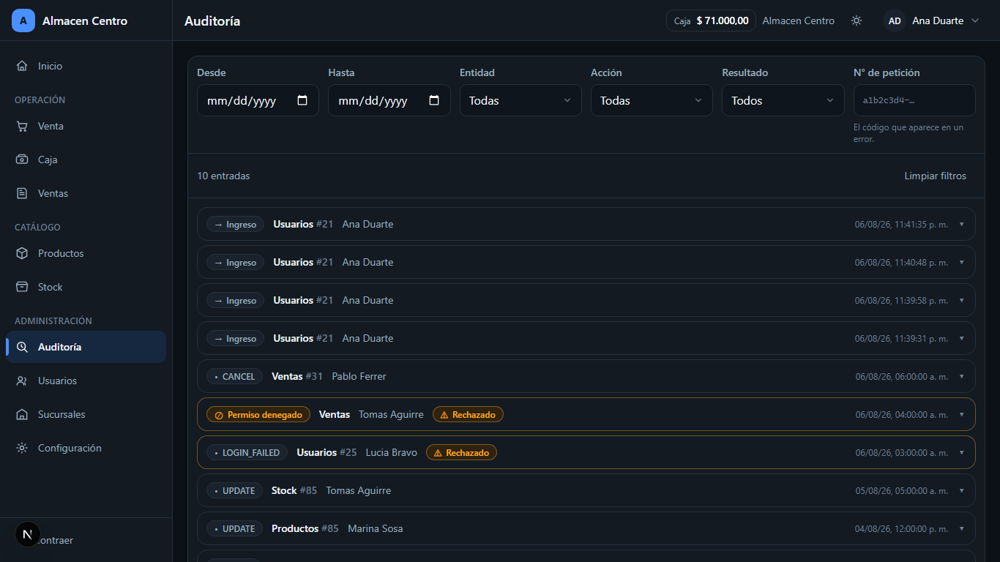 |

Antes decía «No se han registrado ventas en este rango» con la bitácora
cargada, tenía el selector de tabla duplicado y **no mostraba `requestId`, ni
sucursal, ni resultado, ni motivo**: campos que la Fase 1 agregó a la tabla y
que nadie podía ver.

Ahora hay un visor campo/antes/después en vez de un bloque JSON, y los valores
sensibles no se pintan aunque llegaran.

### Productos

| Antes                                             | Ahora                                            |
| ------------------------------------------------- | ------------------------------------------------ |
|  | 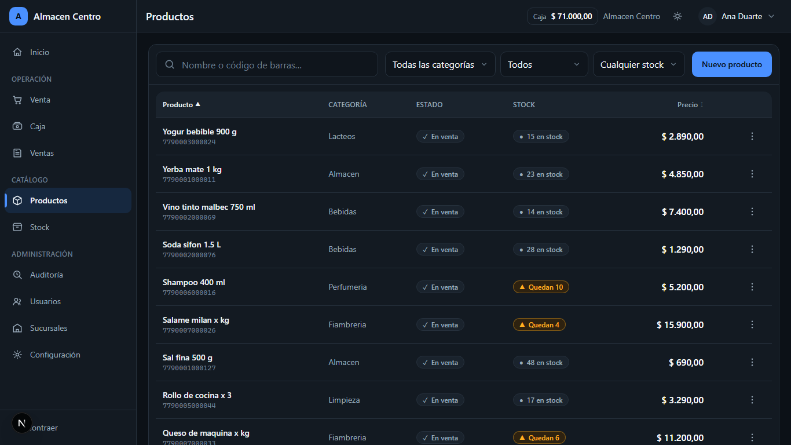 |

«Eliminar» era un botón rojo pegado a «Editar», del mismo tamaño, en cada una
de las cuarenta filas: la acción destructiva más fácil de tocar por accidente
de todo el sistema. Ahora vive dentro del menú de la fila.

Los precios se escribían `$4850.00`, con punto decimal y sin separador de
miles, mientras otra pantalla escribía `$ 134.600,00`. Hay un solo formato.

### Ficha de producto

| Antes                                                    | Ahora                                                   |
| -------------------------------------------------------- | ------------------------------------------------------- |
|  | 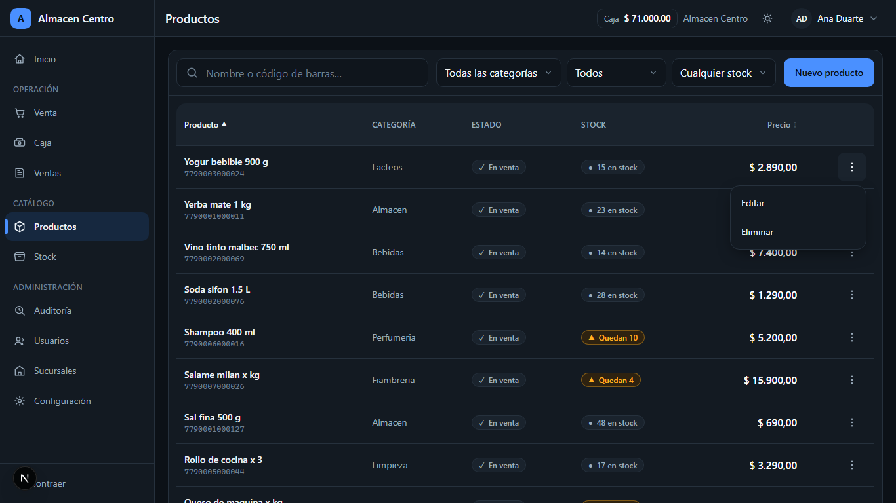 |

Tres cosas cambian, y las tres importan:

1. El fondo del diálogo era **negro opaco**: la pantalla de atrás desaparecía.
2. **«Agregar al stock» estaba dentro del formulario de edición**, sin motivo,
   y se guardaba con el mismo botón que una corrección de descripción. Ahora
   el ajuste tiene su propio diálogo, con motivo obligatorio.
3. El precio era un campo más. Ahora exige `products.price.update`, y sin ese
   permiso **no es un input deshabilitado: es texto**.

### Usuarios

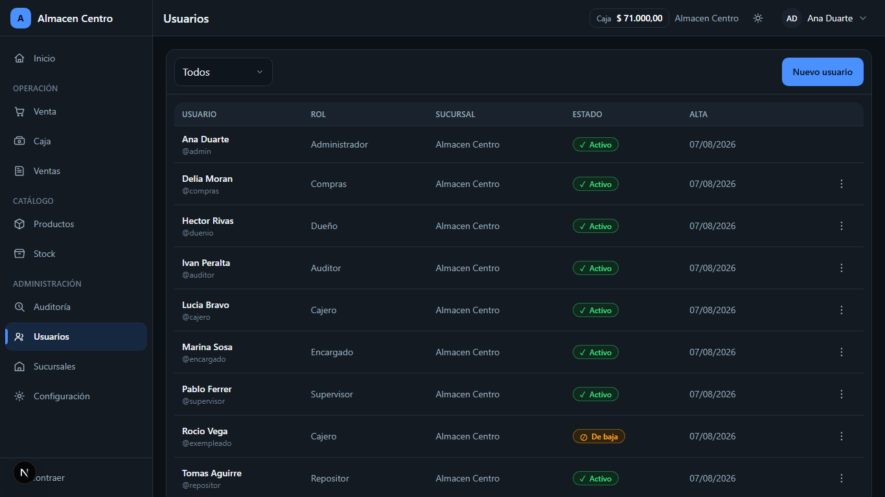

**No existía.** Había `/api/users` con altas, bajas y cambios de rol, y ninguna
pantalla que lo usara: la administración del personal se hacía por API.

`PUT /api/users/:id` es nuevo, y no deja editarse a uno mismo —el único
administrador podía bajarse el rol y dejar el sistema sin nadie que lo
administre— ni tocar personal de otra sucursal. Dar de baja revoca las
sesiones abiertas en el acto.

Abajo, la matriz de permisos de solo lectura, donde se ve que **cambiar un
precio no es lo mismo que editar un producto**.

### Stock

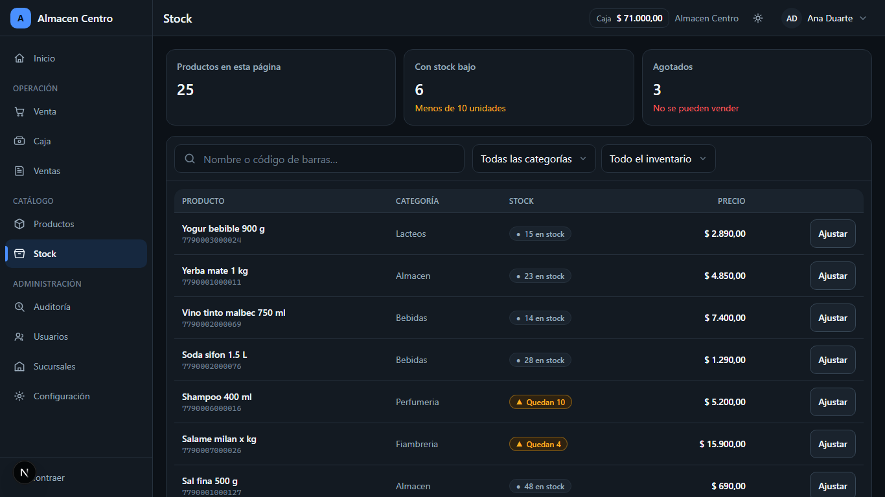

Nueva. Mira lo mismo que el catálogo desde la otra punta: lo que falta
primero. El ajuste acepta las dos formas en que se piensa en el mostrador
—«entraron 12» y «quedan 30»— y cada una va por su verbo: `PATCH` con `delta`,
`PUT` con `quantity`. No es lo mismo: «entraron 12» sobre un stock que otro
acaba de tocar sigue siendo correcto; «quedan 30» pisa lo que haya.

## Decisiones visuales

### Tema oscuro, y elegido

El oscuro es el predeterminado, no una variante. Es el que se usa ocho horas
por día detrás de un mostrador. El claro existe como opción y **no sigue a
`prefers-color-scheme`**: que la aplicación cambie de aspecto porque el
sistema operativo cambió de humor no ayuda a nadie en un mostrador.

### Cuatro colores

Azul para lo interactivo y lo informativo, verde para confirmar y para lo que
entra, ámbar para advertir, rojo para lo que destruye y para lo que sale. Un
quinto tendría que ganarse el lugar. Antes había cinco tarjetas de métricas en
cinco colores saturados distintos sin que el color significara nada.

### Ningún estado depende solo del color

Cada estado trae glifo y texto: una venta anulada dice «✕ Anulada», un egreso
lleva «−» delante del importe, un producto agotado dice «Agotado». Se puede
leer en una impresión en blanco y negro, y lo comprueban las pruebas de
componentes.

### El dinero, un solo formato

`Intl.NumberFormat('es-AR')`, cifras de ancho fijo para que el total no baile
al cambiar, y máximo contraste: es la cifra que hay que leer de un vistazo
desde el otro lado del mostrador.

### Diálogos solo cuando interrumpir está justificado

Confirmar algo irreversible, cobrar, y formularios que no entran en pantalla.
Todo lo demás pasa en la página.

### Tablas en escritorio, tarjetas en el teléfono

Una tabla de siete columnas a 375 px no se arregla achicando la fuente. Las
más anchas —caja, ventas, usuarios y la matriz de permisos— pasan a tarjetas
por debajo de 1024 px; las de cinco o seis columnas, por debajo de 768.

## Lo que se pospuso, y por qué

| Qué                                          | Por qué                                                                                                   |
| -------------------------------------------- | --------------------------------------------------------------------------------------------------------- |
| **Pago combinado**                           | `Sale` guarda un solo `paymentMethod`. Ofrecerlo sería un botón que miente. Necesita modelo nuevo: Fase 3 |
| **Turnos de caja con apertura y cierre**     | Fuera del alcance pedido. La pantalla lo advierte en vez de esconderlo                                    |
| **Cambio de contraseña desde la aplicación** | Mezclarlo con la edición del perfil permitiría cambiarla sin conocer la anterior                          |
| **Editar permisos por rol**                  | Viven en el código. Moverlos a la base es un cambio de modelo, no de interfaz                             |
| **Venta sin conexión**                       | Excluida explícitamente del pedido                                                                        |
| **Productos por peso**                       | Excluida explícitamente                                                                                   |
| **Impresión fiscal y ARCA**                  | Excluidas explícitamente                                                                                  |
| **Recuperación de contraseña**               | No hay soporte seguro real: haría falta correo saliente verificado                                        |

## Lo que apareció al probar

Seis defectos que no se veían mirando la pantalla y que encontraron las
pruebas nuevas:

| Qué                                                                              | Lo encontró                         |
| -------------------------------------------------------------------------------- | ----------------------------------- |
| Toda la API respondía 500 en el navegador: `handler()` confiaba en `args.params` | El primer intento de sacar capturas |
| El ticket no sobrevivía a un F5: se borraba antes de poder leerse                | E2E del F5                          |
| La caja podía vender un producto dado de baja                                    | E2E del escaneo                     |
| El ajuste de stock pedía `products.update`, que un repositor no tiene            | E2E de ajuste de stock              |
| La matriz de permisos arrastraba la página al costado a 375 px                   | E2E responsive                      |
| Dos objetivos táctiles por debajo de 44 px                                       | E2E de objetivos táctiles           |

Y dos del seed de demostración —medios de pago inexistentes y el tipo de
movimiento equivocado— que hacían que el reporte mostrara «Sin Registrar».
